# InGateway501用户手册
## 1. 设备简介
**待补充内容**
## 2. 设备安装
**待补充内容**

## 3. 概述
InGateway501（以下简称IG501）系列边缘计算网关是映翰通公司面向工业物联网领域推出的一款尺
寸小巧，紧凑型边缘网关。该产品凭借全球部署的 3G/4G 无线网络和多种宽带服
务，提供随处可得的不间断的互联网接入。以其强大的边缘计算能力、全面的安全性
和无线接入服务等特性，实现多达万级的设备联网，为真正意义上的设备信息化提供
数据的高速通路。  
IG501拥有开放式边缘计算平台，在物联网边缘节点实现数据优化、实时响应、敏捷连接、智能分析；显著减少现场与中心端的数据流量，并避免云端运算能力遇到瓶颈。优化网络架构，更安全、更快响应，同时更智能化实现现场业务。  
IG501常见的应用场景如下图所示：  
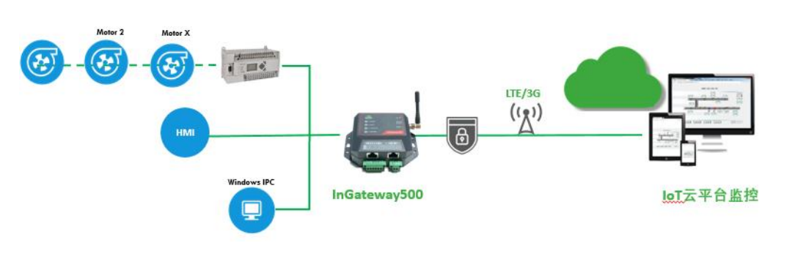

## 4. 设备配置说明
### 4.1 访问网关
- 步骤1：IG501的FE 0/1口的默认ip地址为**192.168.1.1**，设置PC的IP地址与FE 0/1口处于同一网段。  
  - 方法一：自动获取IP地址（推荐）  

     

  - 方法二：使用固定IP地址  
    选择“使用下面的IP地址”，输入IP地址（默认为192.168.1.2~192.168.1.254中任意值）；子网掩码（默认255.255.255.0）；默认网关（默认为192.168.1.1）以及DNS服务器地址，单击<确定>。  

    

- 步骤2：打开浏览器，访问IG501的FE 0/1口IP地址并输入登录用户名和密码。设备出厂的用户名/密码默认为**adm/123456**。  

  

- 步骤3：登录成功后，您可以看到如下图所示的网页。

  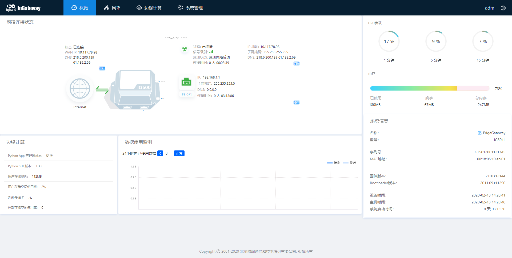

### 概览
“概览”页面展示了IG501的网络连接状态、系统信息和数据使用情况等信息，你可以通过该页面快速了解到IG501的运行情况。  
登录IG501 WEB页面后默认展示“概览”页面，或者点击“概览”进入此页面，页面展示的信息如下：
- 网络连接状态：展示IG501的网络连接情况以及网络配置。
  - 外部网络状态：点击“设置”后跳转至[静态路由](#静态路由)页面。
  - 拨号网络状态：点击“设置”后跳转至[蜂窝网](#蜂窝网)页面。
  - FE 0/1网络状态：点击“设置”后跳转至[以太网](#以太网)页面。

  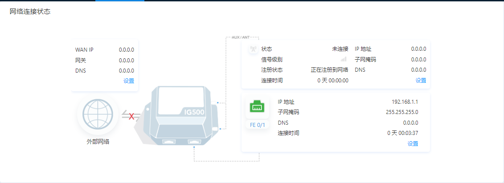  

- 边缘计算：展示边缘计算状态信息。  

  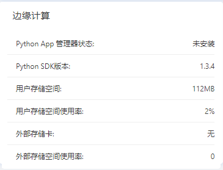  

- 数据使用监测：展示最近24小时的流量使用情况，每小时生成一条数据。  

  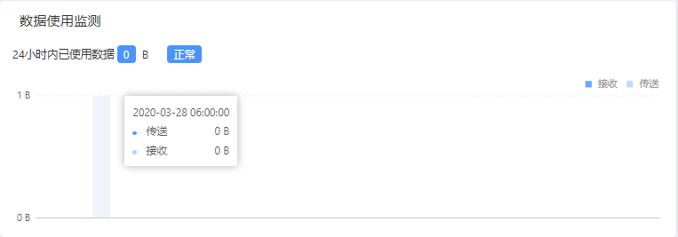  

- CPU负载：展示最近1分钟、5分钟、15分钟的CPU使用情况。  

    

- 内存：展示当前内存使用情况。  

  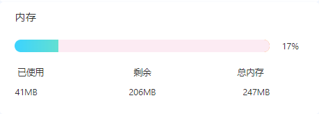  

- 系统信息：点击“编辑”按钮可修改IG501名称  

  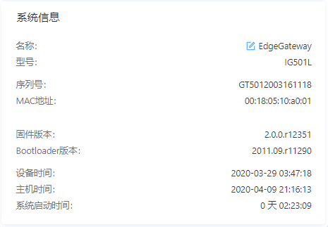 

### 网络
#### 网络接口
##### 蜂窝网
“蜂窝网”页面展示了IG501的拨号接口配置情况和状态信息，你可以在此页面配置拨号接口参数实现IG501的无线网络连接功能或者查看详细的状态信息。配置拨号接口的步骤如下：
1. 选择“网络 > 网络接口 > 蜂窝网”，进入“蜂窝网”界面。  
2. 勾选“启用蜂窝网”。
3. 依次配置各项参数（通常使用默认配置即可），参数说明见[蜂窝网参数说明](#cellular-parameter-description)。
4. 单击“提交”，完成拨号接口的配置。

   

蜂窝网参数说明如下： 
- 启用蜂窝网：启用/关闭蜂窝网  
- 拨号参数集  
  - 网络类型：用户选择设备所使用的移动网络类型，可选择GSM、CDMA。  
  - APN：APN（Access Point Name）用来标识 WCDMA/LTE 网络的业务种类， WCDMA/LTE 系 统 根 据 用 户 连 接WCDMA/LTE 网络的 APN 提供相应的服务。(CDMA2000 系列不设置此项)   
  - 拨号号码：拨号使用的拨号串。拨号串由运营商提供，请向运营商获取。  
    - 当 3G/LTE 数据卡支持 WCDMA 或 LTE 标准时，缺省拨号串为`*99***1#` 。  
    - 当 3G 数据卡支持 CDMA2000 标准时，缺省拨号串为`#777`。  
  - 认证方式  
    - PAP:密码认证协议，通过两次握手提供一种简单明文认证方式。  
    - CHAP:挑战握手认证协议，通过三次握手确认摘要信息从而进行安全认证。  
    - MS-CHAP:微软公司的 CHAP 标准。  
    - MS-CHAPv2:MS-CHAP 升级版本，它要求双向验证。  
  - 用户名：指定接入外部 PDN 网络用户的用户名。由运营商提供。缺省用户名为`gprs`。  
  - 密码：指定接入外部 PDN 网络用户的密码。由运营商提供。缺省用户名为`gprs`。  
- 网络选择方式：支持自动、3G、4G三种网络。用户根据所使用设备及 SIM 卡适用的情况，可选择特定的网络方式，或使用自动方式，设备可自行注册到适用当前网络状况的网络方式。  
- 拨号参数集：拨号策略选择，对应于拨号参数集配置索引项。  
- 启用漫游：勾选启用漫游功能，在漫游状态下可以正常拨号上网，当取消漫游选项，漫游的 SIM 卡不能拨号上网使用本地卡时，勾选漫游和取消漫游功能都不影响 SIM 卡拨号上网。  
- PIN code：PIN 码即 SIM 卡的个人识别密码。如果启用 PIN 码，当不设置 PIN 码或设置错误的 PIN 码，设备拨号失败；设置正常的 PIN 码，设备可以正常拨号上网。  
- 静态IP：拨号时是否使用静态 IP，可以手动指定 IP 地址。设备每次拨号都获得配置的静态 IP。  
- 连接方式   
  - 永远在线：永远在线是系统默认拨号方式，正常状态下设备一直在线只有拨号口没有任何流量时会 30 分钟掉线重新拨号。
  - 按需拨号  
    - 数据激活：默认设备为不在线状态，当有去往公网数据时，自动拨号成功。  
  - 手工拨号：通过蜂窝网界面状态中的的“连接”和“断开”按钮连接和断开网络连接。  
- 重拨间隔：设备每次掉线重新拨号等待的时间。  
- ICMP探测  
  - ICMP探测服务器：要探测的远端 IP 地址或域名（同时启用两个 ICMP 探测服务器，建议同时输入 IP 地址或同时输入域名）。设备支持两个 ICMP 探测服务器：主服务器和备份服务器。当配置两个服务器后，首先检测第一个服务器，只有当第一个服务器达到最大重试次数后，系统才会检测第二个服务器。当两个服务器都检测失败的情况下，设备会重新拨号并进行下一轮 ICMP 探测。  
  - ICMP探测间隔时间：设备发送 ICMP 探测报文的时间间隔。  
  - ICMP探测超时时间：在设置的 ICMP 探测超时时间内，没有收到 ICMP 响应包认为本次 ICMP 探测超时。  
  - ICMP探测最大重试次数：设置 ICMP 探测失败时的最大重试次数（达到最大次数后会重新拨号）。  
  - ICMP严格探测：当设备的拨号接口有数据流量时。设备不发送 ICMP 探测。当拨号接口没有数据流量时候才会发送 ICMP 探测，可以达到节省流量目的。  
- 高级设置  
  - 初始化命令：可以配置一些 AT 指令查询模块状态。  
  - 信号查询间隔：设备拨号成功后，将以设置的查询间隔时间定时查询信号状态。如设置查询间隔时间为 60s。设备拨号成后，拔下设备天线，等到 60s 后设备信号应该降低，在 60s 内设备信号不发生变化。0 表示禁用。  
  - 拨号超时时间：在设定的超时时间内，设备未成功拨号，认为拨号超时，设备重新检测模块并重新拨号。  
  - MRU：最大接收单元，以字节为单位。  
  - MTU：最大传输单元，以字节为单位。  
  - 启用调试模式：启用调试模式后系统日志将打印更为详细的信息。  

##### 以太网
“以太网”页面展示了IG501的以太网接口配置情况和状态信息，你可以在此页面配置以太网接口参数或者查看详细的状态信息。配置以太网接口的步骤如下：
1. 选择“网络 > 网络接口 > 以太网”，进入“以太网”界面。  
2. 选择FE 0/1接口的网络类型。    
3. 依次选择或输入各项参数，参数说明见[以太网参数说明](#ethernet-parameter-description)。  
4. 单击“提交”，完成FE 0/1接口的配置。   

配置FE 0/1接口（网络类型为DHCP），如下图所示：  

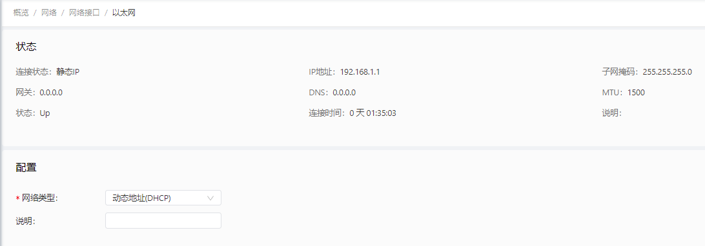  

配置FE 0/1接口（网络类型为静态IP），如下图所示：  

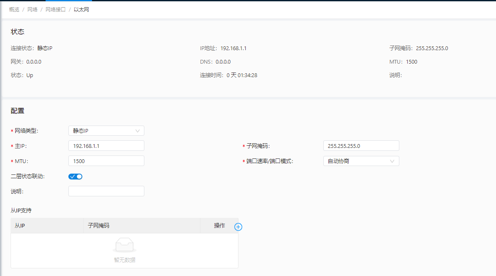  

   

以太网参数说明如下：  
- 网络类型（默认为静态IP）  
  - 静态IP：手动为FE 0/1接口配置IP地址和子网掩码等信息  
  - 动态地址（DHCP）：配置接口作为DHCP客户端，使用DHCP方式获取IP地址和子网掩码等信息  
- 主IP：FE 0/1接口的IP地址，默认值为192.168.2.1。（静态IP模式时支持）  
- 子网掩码：FE 0/1接口的子网掩码。（静态IP模式时支持）  
- MTU：最大传输单元，以字节为单位，默认值为1500。（静态IP模式时支持）  
- 端口速率/端口模式（静态IP模式时支持）  
  - 自动协商
  - 100M 全双工
  - 100M 半双工
  - 10M 全双工
  - 10M 半双工
- 二层状态联动：开启后，端口没物理连接状态为 Down，有物理连接时为 UP；关闭后，端口有无物理连接时都显示 UP。（静态IP模式时支持）  
- 说明：以太网接口的描述信息，标识作用。
- 从IP支持：除主 IP 以外用户还可以配从 IP 地址，最多可以配置 10 个。（静态IP模式时支持） 

##### 环回接口
环回接口是IG501上的一个逻辑、虚拟接口，创建并配置好环回接口之后，它的地址是能被 ping 或 telnet 的，这就可以用来测试网络的连通性。你可以在“环回接口”页面配置或者查看环回接口参数。配置环回接口接口的步骤如下：
1. 选择“网络 > 网络接口 > 环回接口”，进入“环回接口”界面。你可以在此页面设置和查看环回接口的网络参数。  
2. 单击“从IP支持”中的“添加”按钮新增环回接口从IP（默认提供127.0.0.1的环回接口）。    
3. 依次输入IP地址和子网掩码参数。  
4. 单击“提交”，完成环回接口的配置。 

添加环回接口从IP：127.0.0.2，如下图所示：  

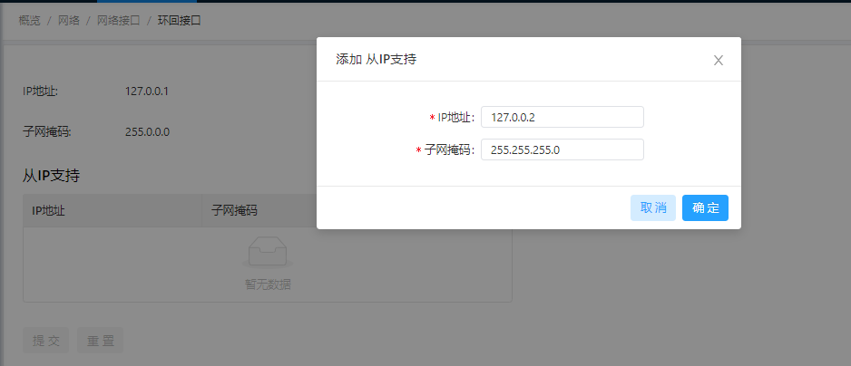

注意：最多可以配置 10 个从IP地址。

#### 网络服务
##### DHCP服务
###### DHCP服务器
DHCP 采用客户端/服务器通信模式，由客户端向服务器提出配置申请，服务器返回为客户端分配的 IP 地址等相应的配置信息，以实现 IP 地址等信息的动态配置。你可以在“DHCP服务器”页面设置和查看DHCP服务器的配置情况。DHCP服务器配置步骤如下：
1. 选择“网络 > 网络服务 > DHCP服务 > DHCP服务器”，进入DHCP服务器界面。  
2. 点击“添加”或“编辑”按钮配置DHCP服务。  
3. 依次配置各项参数，参数说明见[DHCP服务器参数说明](#dhcp-server-parameter-description)。  
4. 点击“确定”保存配置并点击“提交”应用配置。  

配置DHCP服务器，如下图所示：  

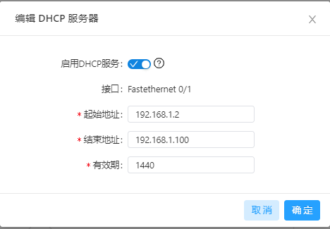  

  

- DHCP服务器参数说明如下：
  - 启用DHCP服务：启用/关闭DHCP服务。注意：DHCP 服务器和 DHCP 中继不能同时被启用。
  - 接口：仅支持Fastethernet 0/1接口。
  - 起始地址：设置地址池中分配给客户端设备的起始 IP 地址。
  - 结束地址：设置地址池种分配给客户端设备的结束 IP 地址。
  - 有效期：设置分配 IP 的地址的有效期，过期 DHCP 服务器将回收分配给客户端的 IP 地址并重新分配 IP 地址，不能为空。  
- Windows名称服务器(WINS)：WINS 服务器的 IP 地址。
- 静态IP设置：你可以通过静态IP设置来配置指定MAC地址使用固定的IP地址，如下图:  

  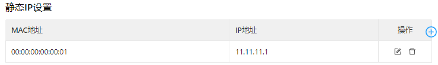

###### DHCP中继
DHCP中继（也叫做DHCP中继代理）可以实现在不同子网和物理网段之间处理和转发DHCP信息的功能。你可以在“DHCP中继”页面设置和查看DHCP中继的配置情况。DHCP中继配置步骤如下：  
1. 选择“网络 > 网络服务 > DHCP服务 > DHCP中继”，进入“DHCP中继”界面。  
2. 启用DHCP中继，需关闭DHCP服务器。  
3. 配置DHCP服务器地址和中继接口，参数说明见[DHCP中继参数说明](#dhcp-relay-parameter-description)。  
4. 点击“提交”应用配置。  

配置DHCP中继，如下图所示：  

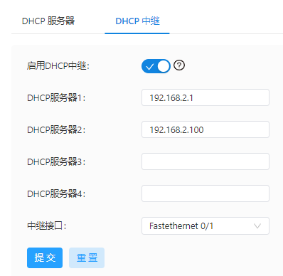

DHCP中继参数说明如下：
- 启用DHCP中继：开启/关闭DHCP中继，不能同时启用DHCP中继和DHCP服务器
- DHCP服务器：DHCP服务器地址。
- 中继接口：作为DHCP中继的网络接口。

##### DNS服务
域名系统（DNS，Domain Name System）是一种用于 TCP/IP 应用程序的分布式数据库，提供域名与 IP 地址之间的转换。通过域名系统，用户进行某些应用时，可以直接使用便于记忆的、有意义的域名，而由网络中的 DNS 服务器将域名解析为正确的 IP 地址。你可以在“DNS服务”页面设置和查看域名服务器及DNS中继服务。
- 域名服务器配置步骤如下：
  1. 选择“网络 > 网络服务 > DNS服务”，进入DNS服务界面。  
  2. 填写DNS服务器地址。
  3. 点击“提交”应用配置。

  配置DNS服务器，如下图所示：  

  

- DNS中继服务配置步骤如下：
  1. 选择“网络 > 网络服务 > DNS服务”，进入DNS服务界面。  
  2. 启用DNS中继服务，启用DHCP服务器时，不可关闭DNS中继服务。
  3. 点击添加按钮添加一个“[ 域名<=>IP地址 ] 对”
  4. 配置主机域名或IP地址，并配置对应的IP地址。
  5. 点击“确定”保存配置并点击“提交”应用配置。
   
  配置DNS中继服务，如下图所示：  

  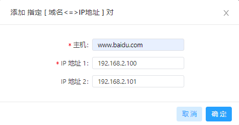

##### 主机列表
你可以在“主机列表”页面查看已连接到IG501的主机信息。
选择“网络 > 网络服务 > 主机列表”，进入“主机列表”界面，如下图所示：  

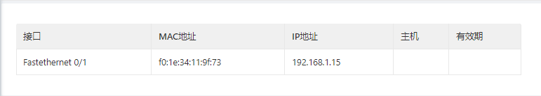

#### 静态路由
##### 静态路由状态
选择“网络 > 静态路由 > 状态”，进入“静态路由状态”界面。你可以在此页面查看静态路由状态信息，如下图所示：  

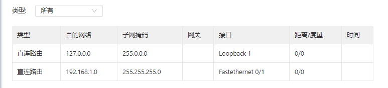

##### 静态路由配置
你可以在“静态路由配置”页面需要手工设置静态路由，设置后，去往指定目的地的报文将按照你指定的路径进行转发（一般不需要设置此项）。配置步骤如下：  
1. 选择“网络 > 静态路由 > 配置”，进入“静态路由配置”界面。
2. 点击“添加”按钮以添加一条静态路由配置
3. 依次配置各项参数，参数说明见[静态路由参数说明](#static-routing-parameter-description)
4. 点击“确定”保存配置并点击“提交”应用配置。

配置静态路由，如下图所示：  

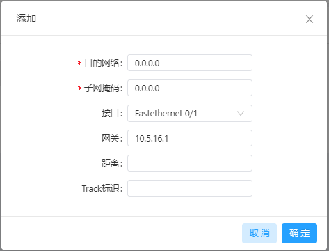

静态路由参数说明如下：
- 目的网络：需要到达的目的 IP 地址
- 子网掩码：需要到达的目的地址的子网掩码
- 接口：数据到达目的网络使用的接口，用户可选择：Cellular 1、Fastethernet 0/1 
- 网关：数据在到达目的地址前，需要经过的下一个路由器 IP 地址
- 距离：即优先权，数值越小优先级越高
- Track标识：Track 的索引或 ID

#### 防火墙
##### 访问控制列表
ACL 即访问控制列表，通过配置一系列匹配规则，对指定数据流（如限定的源 IP 地址、账号等）执行允许或禁止通过，达到对网络接口数据的过滤。你可以在“访问控制列表”页面设置网络接口数据的过滤策略，配置步骤如下：
1. 选择“网络 > 防火墙 > 访问控制列表”，进入“访问控制列表”界面。  
2. 在“访问控制策略”中点击“添加”按钮添加一条访问控制策略
3. 依次配置各项参数，参数说明见[访问控制策略参数说明](#access-control-strategy-parameter-description)
4. 在“访问控制列表”中点击“添加”按钮或“编辑”按钮为指定接口配置访问控制
5. 依次配置各项参数，参数说明见[访问控制列表参数说明](#access-control-list-parameter-description)
6. 点击“确定”保存配置并点击“提交”应用配置。

配置标准访问控制策略，如下图所示：  

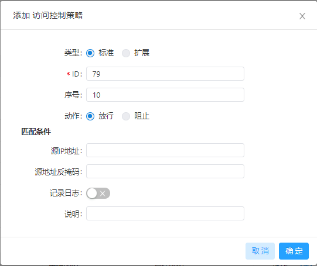  

配置扩展访问控制策略，如下图所示：  

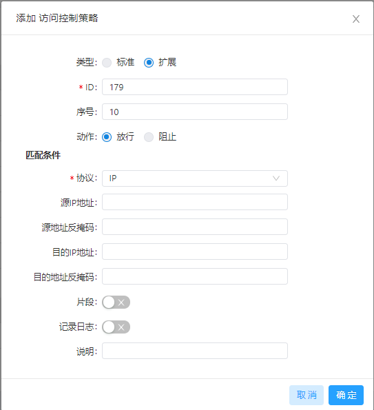  

配置访问控制列表  

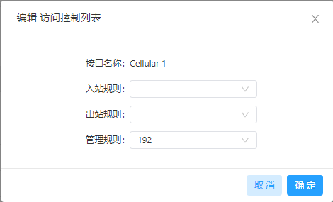

- 标准访问控制策略参数说明如下：
  - ID：ACL 规则ID，范围 1-99，数值越小则优先级越高
  - 序号：ACL 规则序号，数值越小则优先级越高
  - 动作：允许/拒绝报文通过
  - 源IP地址：ACL 规则匹配报文的源地址，为空时表示 any，即所有网络。
  - 源地址反掩码：ACL 规则匹配报文的源地址反掩码
  - 记录日志：启用后系统会记录关于访问控制方面的日志。
  - 说明：便于记录访问控制各项参数意义。

- 扩展访问控制策略参数说明如下：
  - ID：ACL 规则ID，范围 100-199，数值越小则优先级越高
  - 序号：ACL 规则序号，数值越小则优先级越高
  - 动作：允许/拒绝报文通过
  - 源IP地址：ACL 规则匹配报文的源地址，为空时表示 any，即所有网络。
  - 源地址反掩码：ACL 规则匹配报文的源地址反掩码
  - 源端口：源端口号，any 表示 TCP/UDP 报文的任何源端口都匹配。协议为 TCP 或 UDP 时，才可以指定源端口号。
  - 目的IP地址：ACL 规则匹配报文的目的地址，为空时表示 any，即所有网络。
  - 目的地址反掩码：ACL 规则匹配报文的源地址反掩码
  - 目的端口：目的端口号，any 表示 TCP/UDP 报文的任何目的端口都匹配。协议为 TCP 或 UDP 时，才可以指定源端口号。
  - 已建立的连接：启用后则控制已建立 TCP 连接的报文，未建立连接的 TCP 报
文不控制；未启用则控制已建立和未建立的 TCP 报文。协议为 TCP 时，才可以配置此项参数。
  - 片段：控制数据包从接口发送出去时被分片的报文。
  - 记录日志：启用后系统会记录关于访问控制方面的日志。
  - 说明：便于记录访问控制各项参数意义。

- 访问控制列表参数说明如下：
  - 接口名称：包含Cellular1和Fastethernet 0/1接口
  - 规则：选择入站、出站和管理规则

##### 网络地址转换
网络地址转换（NAT） 可以实现局域网内的多台主机通过 1 个或多个公网 IP 地址接入因特网，即用少量的公网 IP 地址代表较多的私网 IP 地址，节省公网的 IP 地址。你可以在“网络地址转换”页面查看和设置网络地址转换规则，配置步骤如下：
1. 选择“网络 > 防火墙 > 网络地址转换”，进入“网络地址转换”界面。  
2. 在“网络接口”中配置接口类型
3. 在“网络地址转换(NAT)规则”中点击“添加”按钮并配置网络地址转换规则，参数说明见[网络地址转换规则参数说明]()
4. 点击“确定”保存配置并点击“提交”应用配置。

网络地址转换规则参数说明如下：
- 动作
  - SNAT：源地址转换，将 IP 数据包的源地址转换成另外一个地址。一般用于从路由器内部发往外部的数据。
  - DNAT：目的地址转换，将 IP 数据包的目的地址转换成另外一个地址。一般用于从路由器外部发往内部的数据。
  - 1:1 NAT：1 对 1 转换 IP 地址。
- 源网络：
  - Inside：内部地址
  - Outside：外部地址
- 转换类型
  - IP to IP
  - IP to INTERFACE
  - IP PORT to IP PORT
  - ACL to INTERFACE
  - ACL to IP
- 匹配访问控制列表：根据配置的 ACL 来转换地址
- 转换成的地址
- 描述信息
### 边缘计算
#### Python边缘计算
“Python边缘计算”页面展示了IG501的Python二次开发环境信息和IG501上的App配置信息及运行状态。你可以通过该页面的二次开发环境信息开发你的定制化Python App，也可以在此页面配置和查看App状态。  
Python环境配置步骤如下：
1. 选择“边缘计算 > Python边缘计算”，进入“Python边缘计算”界面。  
2. 启用Python边缘计算引擎
3. 安装/升级Python SDK，非必须步骤。
4. 启用调试模式即可。如何进行Python二次开发请参考[Python开发快速入门](https://ingateway-development-docs.readthedocs.io/zh_CN/latest/QuickStart.html)。

App配置步骤如下：
1. 选择“边缘计算 > Python边缘计算”，进入“Python边缘计算”界面。  
2. 启用Python边缘计算引擎
3. 安装/升级Python SDK，非必须步骤。
4. 在“配置”中导入App包并勾选启用，App配置说明见[App配置功能说明](#app-configuration-function-description)
5. 点击“提交”应用配置。

配置IG501Python开发环境，如下图所示：

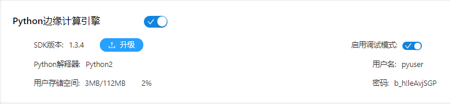

配置App运行，如下图所示（以HelloWorld为例）：

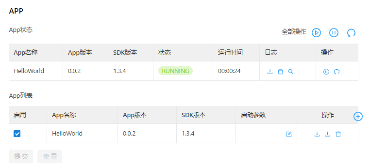

App配置功能说明如下：
- 应用-状态
  - 全部启动：启动所有已启用的App
  - 全部停止：停止所有已启用的App
  - 全部重启：重启所有已启用的App
  - 下载：下载该App的运行日志
  - 删除：清空该App的运行日志
  - 查看：查看该App的运行日志
  - 停止：停止运行该App
  - 重启：重启该App
- 应用-配置
  - 启用：启用App，启用后每次重启设备App都将自动运行
  - 启动参数：某些App需要配置相应的启动参数才能正常运行
  - 导出配置：导出App配置文件
  - 导入配置：导入App配置文件，导入配置文件并重启App后按照导入后的配置文件运行。
  - 卸载：卸载App
  - 添加：添加App

### 系统管理
#### 系统时间
为了保证IG501与其它设备协调工作，你可能需要将系统时间配置准确。为此，你可以在“系统时间”页面设置IG501的系统时间以及通过NTP对网络内所有具有时钟的设备进行时钟同步，使网络内所有设备的时钟保持一致，从而使设备能够提供基于统一时间的多种应用。
系统时间配置步骤如下：
- 方法一：使用时区配置系统时间
  1. 选择“系统管理 > 系统时间”，进入“系统时间”界面。  
  2. 在“系统时间”的“时区”中选择IG501的时区
  3. 选择后点击“应用”即可
- 方法二：手动配置系统时间
  1. 选择“系统管理 > 系统时间”，进入“系统时间”界面。  
  2. 在“系统时间”的设置时间中直接设置设备时间
  3. 设置完成后点击“应用”即可
- 方法三：使用PC的本地时间配置系统时间
  1. 选择“系统管理 > 系统时间”，进入“系统时间”界面。  
  2. IG501会自动获取PC的时间作为本地时间
  3. 点击设备时间中的“同步”，设备时间将与本地时间同步
- 方法四：使用SNTP客户端配置系统时间
  1. 选择“系统管理 > 系统时间”，进入“系统时间”界面。  
  2. 勾选“启用SNTP客户端”
  3. 依次配置各项参数，参数说明见[SNTP客户端参数说明](#sntp-client-parameter-description)
  4. 点击“提交”应用配置。

通过NTP服务器为其他设备同步时间步骤如下：
  1. 选择“系统管理 > 系统时间”，进入“系统时间”界面。  
  2. 勾选“启用NTP服务器”
  3. 依次配置各项参数，参数说明见[NTP服务器参数说明](#ntp-server-parameter-description)
  4. 点击“提交”应用配置。

通过时区或手动设置系统时间，如下图所示：  

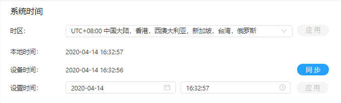  

通过SNTP客户端配置系统时间，如下图所示：  

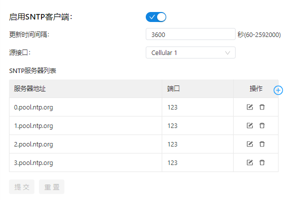  

通过NTP服务器为其他设备提供时间同步，如下图所示：  

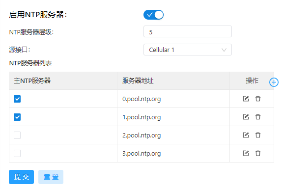  

SNTP客户端参数说明如下：
- 启用SNTP客户端：开启/关闭 SNTP 客户端当配置源接口为 cellular 接口时。拨号不成功情况下不会启动 SNTP 服务。
- 更新时间间隔： 启用SNTP客户端后按照更新时间间隔去同步设备时间。
- 源接口：IG501发出 SNTP 报文的接口。源接口与源地址不能同时使用。
- 源地址：IG501发出 SNTP 报文携带的源地址。源接口与源地址不能同时使用。
- SNTP服务器列表
  - 服务器地址：SNTP 服务器地址（域名/IP），最多可填写 10 个服务器。设置多个 SNTP 服务器时，系统将轮询所有 SNTP 服务器，直到找到可用的。
  - 端口：SNTP 服务器的 SNTP 服务端口

NTP服务器参数说明如下：
- 启用NTP服务器：开启/关闭 NTP 服务器
- 更新时间间隔：NTP 采用分层同步方式，一般第 n+1 级与第 n 级时钟源进行同步。NTP 最多支持 16 层同步，即 0－15 层。多于 16 层将无法同步。
- 源接口：IG501发出 NTP 报文的接口。源接口与源地址不能同时使用。
- 源地址：IG501发出 SNTP 报文携带的源地址。 源接口与源地址不能同时使用。
- NTP服务器列表
  - 主NTP服务器：设置多个 NTP 服务器，勾选主 NTP 服务器时，表示我们的设备主要以该 NTP 服务器进行时间同步。勾选多个则轮询所有已勾选的 NTP 服务器，直到找到可用的。
  - 服务器地址：NTP 服务器地址（域名/IP），最多可填写 10 个服务器。

#### 系统日志
你可以选择“系统管理 > 系统日志”，进入“系统日志”页面。该页面包含了网络和IG501的大量信息，包括运行状态、配置变化等。通过“配置系统日志”页面，可以设置远程日志服务器，IG501将会把所有的系统日志上传到远程日志服务器，这需要主机上的远程日志软件（如:`Kiwi Syslog Daemon`）的配合。

#### 配置管理
选择“系统管理 > 配置管理”，进入“配置管理”界面。你可以在此页面备份配置参数；导入相应的参数配置；使IG501恢复出厂设置。
各功能说明如下：
- 配置管理
  - 自动保存：勾选后，每次修改配置都会自动将配置保存到startup-config。
  - 加密：启用后IG501在 WEB 上配置的所有带密码的参数都会以加密的方式显示。提高密码安全性。 
- 配置文件操作
  - 导入 startup-config：将配置文件导入到路由器 startup-config 中,重启
后会加载导入的配置。请确保导入的配置的合法性与有序性。导入配置时，IG501会过滤格式不合法的命令，然后将正确的配置存储为startup-config，在系统重启后顺序执行这些配置。如果导入的配置内容不是按照有效的顺序排列，将导致系统不能进入期望的状态。 
  - 导出 startup-config：备份 startup-config 到主机，startup-config 为
IG501开机启动时候的配置。
  - 导出 running-config：备份 running-config 到主机，running-config 为
IG501当前正在运行的配置。
  - 恢复出厂设置：将IG501恢复到出厂配置，IG501所有的配置被恢复到
默认参数。恢复出厂后需要重新启动IG501才能生效。

#### 设备远程监控平台
映翰通开发的设备远程监控平台支持监视IG501状态、远程维护现场设备、远程批量下发IG501配置和IG501批量升级等功能，帮助用户便捷、高效的管理IG501和现场设备。你可以在“设备远程监控平台”页面配置IG501连接到设备远程监控平台上以使用平台的功能和服务。连接方法如下：
1. 选择“系统管理 > 设备远程监控平台”，进入“设备远程监控平台”界面。  
2. 启用设备远程监控平台
3. 依次配置各项参数，参数说明见[设备远程监控平台参数说明](#equipment-remote-monitoring-platform-parameter-description)
4. 点击“提交”应用配置。

配置IG501连接到`c.inhandcloud.com`（DM）平台，如下图所示：

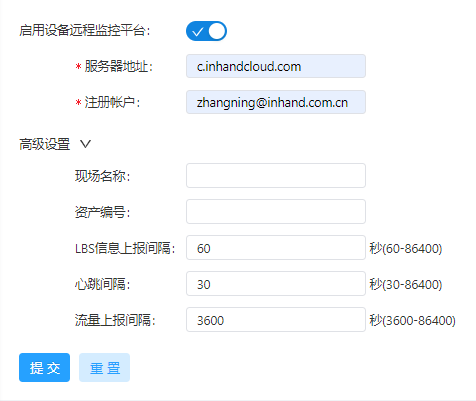

设备远程监控平台参数说明如下：
- 启用设备远程监控平台：启用/关闭设备远程监控平台
- 服务器地址：需要连接的云平台服务器地址
- 注册账户：云平台上已注册账户名称
- 高级设置
  - 现场名称：IG501在云平台服务器的现场名称
  - 资产编号：IG501在云平台服务器的资产编号
  - LBS 信息上报间隔：LBS 信息上报时间间隔，合法值60-86400
  - 心跳间隔：与云平台的心跳间隔，合法值30-86400
  - 流量上报间隔：流量信息上报时间间隔，合法值3600-86400

#### 固件升级
你可以在“固件升级”页面升级IG501的固件版本以支持新功能或者获得更好的使用体验。固件版本升级步骤如下：
1. 选择“系统管理 > 固件升级”，进入“固件升级”界面。  
2. 点击“选择文件”选择IG501固件文件。
3. 点击“开始升级”并“确认”开始升级。
4. 等待升级成功，升级成功后点击“重启”按钮重启IG501即可完成升级。

#### 管理工具
为便于管理和配置IG501,你可以在“管理工具”页面配置IG501的管理和访问方式。配置步骤如下：
- 配置HTTPS
  1. 选择“系统管理 > 管理工具”，进入“管理工具”界面。  
  2. 勾选“启用HTTPS”并依次配置各项参数，参数说明见[HTTPS参数说明](#https-parameter-description)
  3. 点击“提交”应用配置。
- 配置TELNET
  1. 选择“系统管理 > 管理工具”，进入“管理工具”界面。  
  2. 勾选“启用TELNET”并依次配置各项参数，参数说明见[TELNET参数说明](#telnet-parameter-description)
  3. 点击“提交”应用配置
- 配置SSH
  1. 选择“系统管理 > 管理工具”，进入“管理工具”界面。  
  2. 勾选“启用SSH”并依次配置各项参数，参数说明见[SSH参数说明](#ssh-parameter-description)
  3. 点击“提交”应用配置

配置HTTPS管理，如下图所示：  

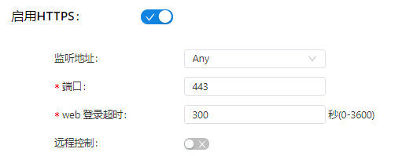  

配置TELNET管理，如下图所示：  

  

配置SSH管理，如下图所示：  

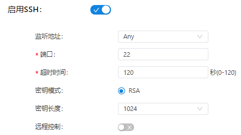

HTTPS参数说明如下：
1. 监听地址：可选Any、127.0.0.1以及FE 0/1接口的IP地址
2. 端口：HTTPS访问端口号
3. web登录超时：登录web页面的超时时间，合法值0-3600
4. 远程控制：开启后可以通过HTTPS远程访问IG501。如果远程控制访问网络为空，则说明任意网络均可远程控制IG501。

TELNET参数说明如下：
1. 监听地址：可选Any、127.0.0.1以及FE 0/1接口的IP地址
2. 端口：TELNET访问端口号
3. 远程控制：开启后可以通过TELNET远程访问IG501。如果远程控制访问网络为空，则说明任意网络均可远程控制IG501。

SSH参数说明如下：
1. 监听地址：可选Any、127.0.0.1以及FE 0/1接口的IP地址
2. 端口：SSH访问端口号
3. 超时时间：SSH超时时间，合法值0-120
4. 密钥模式：RSA
5. 密钥长度：可选512/1024/2048/4096
6. 远程控制：开启后可以通过TELNET远程访问IG501。如果远程控制访问网络为空，则说明任意网络均可远程控制IG501。

#### 用户管理
你可以在“用户管理”页面新添加一个用户或者管理用户的账号密码及访问权限，实现多用户访问和管理IG501。添加一个用户的步骤如下：
1. 选择“系统管理 > 用户管理”，进入“用户管理”界面。  
2. 点击“添加”按钮添加用户
3. 依次配置各项参数
4. 点击“确定”保存配置

#### 重启
你可以选择“系统管理 > 重启”，进入“重启”界面，在该页面重启IG501或设置IG501定时重启计划。  
配置IG501每天0时0分重启一次，如下图所示：  

#### 工具
选择“系统管理 > 工具”，进入“工具”页面。你可以在此页面诊断IG501的网络问题。 专家选项中可以输入一些扩展选项，如：Ping工具中的专家选项配置 -t 即为连续 ping 指定主机，直到停止。  
使用Ping工具探测网络是否可达，如下图所示：  

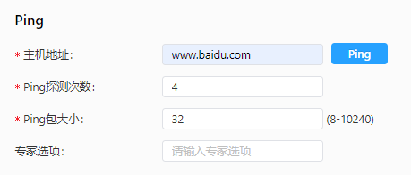  

使用路由探测工具确定 IP 数据报访问目标所采取的路径，如下图所示：

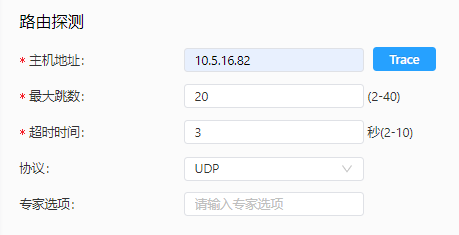  

使用网络抓包工具抓取对指定接口上传输的数据进行抓取，如下图所示：  

#### 第三方软件声明
选择“系统管理 > 第三方软件声明”，进入第三方软件声明页面。你可以在此查看IG501软件的第三方软件声明。

### 导航栏操作
#### 返回首页
你可以在IG501的任意WEB界面点击左上角的映翰通InGateway logo以快速跳转至“概览”页面。  

#### 退出登录
你可以点击右上角的用户名以退出登录。

#### 切换语言
你可以点击右上角的“语言”以切换WEB界面的语言显示，IG501支持简体中文和English两种语言。

## 命令行指令说明
### 帮助命令
在控制台输入 help 或 ? 可获取命令帮助，在输入命令的过程中可随时输入 ? 获取当前命令或命令参数的帮助，在命令或命令参数唯一时还能自动补全命令或参数。
#### 1.1 ?
**命令**：[\<cmd>] ?  
**功能**：获取命令的帮助。  
**视图**：所有视图  
**参数**：命令名cmd  
**示例**：
- 输入：`?`  
获得当前所有可用命令的列表。  
- 输入：`show ?`  
显示 show 命令的所有参数及其使用说明。  

### 视图切换命令
#### 2.1 enable
**命令**：enable 15 [\<password>]  
**功能**：切换到特权用户级别。  
**视图**：普通用户视图  
**参数**：
- 15：用户权限级别，目前只支持权限级别 15（超级用户）  
- password：特权级别对应的密码，如果不输入则会给出输入密码的提示  

**示例**：
- 在普通用户视图下输入： `enable 15 123456`
切换到超级用户，密码为 123456。

#### 2.2 disable
**命令**：disable  
**功能**：退出特权用户级别。  
**视图**：超级用户视图，配置视图  
**参数**：无   
**示例**：
- 在超级用户视图下输入： `disable`  
返回普通用户视图。

#### 2.3 exit
**命令**： exit  
**功能**：退出当前视图，返回前一视图（如果当前为普通用户视图则退出控制台。   
**视图**：所有视图  
**参数**：无   
**示例**：
- 在配置视图下输入： `exit`  
返回到超级用户视图。  
- 在普通用户视图下输入： `exit`  
  退出控制台。

### 查看系统状态命令
#### 3.1 show version
**命令**：show version  
**功能**：显示路由器的型号、软件版本等信息。   
**视图**：所有视图  
**参数**：无   
**示例**：
- 输入： show version
  显示如下信息：  
  型号 : 显示IG501出厂型号  
  序列号 : 显示IG501出厂序列号  
  固件版本 : 显示IG501固件版本  
  Bootloader 版本 : 显示IG501的Bootloader版本  

#### 3.2 show system
**命令**：show system  
**功能**：显示路由器系统信息。   
**视图**：所有视图  
**参数**：无   
**示例**：
- 输入： `show system`  
显示如下示例信息：
`09:26:45 up 5 days, 14:33,  1 users,  load average: 0.00, 0.01, 0.04`

#### 3.3 show clock
**命令**：show clock  
**功能**：显示路由器的系统时间。   
**视图**：所有视图  
**参数**：无   
**示例**：
- 输入： `show clock`  
  显示如下示例信息：  
  `Wed Apr 15 09:33:48 UTC 2020`

#### 3.4 show log
**命令**：show log [lines \<n>]  
**功能**：显示路由器的系统日志，默认显示最新的 100 条日志。   
**视图**：所有视图  
**参数**：lines <n> 限制显示的日志条数，其中 n 为正整数时显示最新的 n 条日志，为负整数时显示最早的 n 条日志，为 0 表示输出所有日志。  
**示例**：
- 输入： `show log`  
  显示最新的 100 条日志记录。
- 输入： `show log lines 10`  
  显示最新的 10 条日志记录。

#### 3.5 show users
**命令**：show users  
**功能**：显示路由器的用户列表。   
**视图**：所有视图  
**参数**：无  
**示例**：
- 输入： `show users`  
  显示如下示例信息：  
  <table>
  <tr>
  <td>USER</td>
  <td>TTY</td>
  <td>IDLE</td>
  <td>TIME</td>
  <td>HOST</td>
  </tr>
  <tr>
  <td>adm</td>
  <td>pts/0</td>
  <td>00:00</td>
  <td>Apr 15 09:26:41</td>
  <td>192.168.1.15</td>
  </tr>
  </table>

#### 3.6 show startup-config
**命令**：show startup-config  
**功能**：显示路由器的启动配置。   
**视图**：超级用户视图、配置视图  
**参数**：无  
**示例**：
- 输入： `show startup-config`  
  显示系统的运行配置。

### 4. 查看网络状态命令
#### 4.1 show interface
**命令**：show interface  
**功能**：显示路由器的接口状态信息。   
**视图**：所有视图  
**参数**：无  
**示例**：
- 输入： `show interface`  
  显示所有接口的状态信息。

#### 4.2 show ip route  
**命令**：show ip route  
**功能**：显示路由器的路由表。   
**视图**：所有视图  
**参数**：无  
**示例**：
- 输入： `show ip route`  
  显示系统的路由表。

#### 4.3 show arp
**命令**：show arp  
**功能**：显示路由器的 ARP 表。   
**视图**：所有视图  
**参数**：无  
**示例**：
- 输入： `show arp`  
  显示系统的ARP表。

### 5. 网络测试命令
IG501提供了 ping、telnet 和 traceroute 等网络测试工具用于网络测试。
#### 5.1 ping
**命令**：ping \<hostname> [count \<n>] [size \<n>] [source \<ip>]  
**功能**：对指定的主机执行 ICMP 探测。   
**视图**：所有视图  
**参数**：
- hostname: 要探测的主机地址或域名  
- count \<n>: 探测的次数  
- size \<n>: 探测数据包的大小（字节）  
- source \<ip>: 指定探测时所使用的 IP 地址  

**示例**：
输入： ` ping www.baidu.com count 5 size 32`  
执行对 www.baidu.com 的探测并显示探测结果。

#### 5.2 telnet
**命令**：telnet \<hostname> [\<port>] [source \<ip>]   
**功能**：telnet 登录到指定的主机。   
**视图**：所有视图  
**参数**：  
- hostname： 要 telnet 登录的主机地址或域名  
- port： telnet 的端口  
- source \<ip>： 指定 telnet 登录时所使用的 IP 地址  

**示例**：
- 输入： `telnet 192.168.1.1`  
telnet 登录到 192.168.2.2。

#### 5.3 traceroute
**命令**：traceroute \<hostname> [maxhops \<n>] [timeout \<n>]   
**功能**：对指定的主机执行路由探测。   
**视图**：所有视图  
**参数**：  
- hostname： 要探测的主机地址或域名  
- maxhops \<n>：探测的最大路由跳数
- timeout \<n>： 每一跳探测的超时时间（秒）  

**示例**：
- 输入： `traceroute www.baidu.com`  
执行对 www.baidu.com 的路由探测并显示探测结果。

### 6. 配置命令
在超级用户视图下，路由器可用 `configure terminal` 命令切换到配置视图对IG501进行管理。一些设置
命令同时支持 no 和 default 两种变形，其中 no 表示取消某项参数的设置，default 表示恢复
某项参数为默认配置。
#### 6.1 configure terminal 
**命令**：configure terminal   
**功能**：切换到配置视图，从终端输入配置。   
**视图**：超级用户视图  
**参数**：无    
**示例**：
- 在超级用户视图下输入： `configure terminal`  
切换到配置视图。

#### 6.2 hostname
**命令**：  
- hostname [\<hostname>]   
- default hostname  

**功能**：设置路由器的主机名。   
**视图**：配置视图   
**参数**：\<hostname>：新的主机名    
**示例**：
- 在配置视图下输入： `hostname MyRouter`  
设置IG501的主机名为 MyRouter。  
- 在配置视图下输入： `default hostname`  
恢复IG501的主机名为出厂设置。

#### 6.3 clock timezone
**命令**：
- clock timezone \<timezone>-\<n>   
- default clock timezone  
**功能**：设置路由器的时区信息。   
**视图**：配置视图  
**参数**：
- \<timezone>：时区名称，3 个大写英文字母  
- \<n>：时区偏差值，-12~+12  
**示例**：
- 在配置视图下输入： `clock timezone CST-8`  
设置路由器的时区为东八区，时区名为 CST（中国标准时间）。  
- 在配置视图下输入： `default clock timezone`  
恢复路由器的时区为出厂设置。

#### 6.4 clock set
**命令**：clock set \<YEAR/MONTH/DAY>-\<HH:MM:SS>   
**功能**：设置路由器的日期和时间。   
**视图**：配置视图  
**参数**：
- \<YEAR/MONTH/DAY>： 日期，格式为：年-月-日
- \<HH:MM:SS>： 时间，格式为：小时-分钟-秒   

**示例**：
- 在配置视图下输入： `clock set 2009.10.5-10:01:02`  
设置路由器的时间为 2009 年 10 月 5 日上午 10 点 01 分 02 秒。

#### 6.5 sntp-client
**命令**：
- sntp-client update-interval \<n>  
- sntp-client source interface \<interface> \<slot/port>   
- sntp-client server \<hostname> [\<port>] \<n>   

**功能**：设置网络时间SNTP客户端。   
**视图**：配置视图  
**参数**：
- \<hostname>： 时间服务器的主机地址或域名  
- [\<port>] \<n>：时间服务器端口号
- \<interface> \<slot/port>：源接口，合法值`cellular1`和`fastethernet 0/1`  
- update-interval \<n>：更新时间间隔，合法值  

**示例**：
- 在配置视图下输入： `sntp-client update-interval 7200`  
  设置SNTP客户端的更新时间间隔为7200秒。
- 在配置视图下输入： `sntp-client source interface cellular 1`  
  设置SNTP客户端的源接口为cellular1。
- 在配置视图下输入： `sntp-client server 0.pool.ntp.org port 123`  
  设置SNTP客户端的服务器地址为 0.pool.ntp.org ，端口号123。

### 7. 系统管理命令
#### 7.1 reboot
**命令**：reboot   
**功能**：重启系统。   
**视图**：超级用户视图，配置视图  
**参数**：无    
**示例**：
- 在超级用户视图下输入： `reboot`  
  系统重新启动。

#### 7.2 enable password
**命令**：enable password [\<password>]   
**功能**：更改超级用户的密码。   
**视图**：配置视图  
**参数**：\<password>：新的超级用户密码     
**示例**：
- 在配置视图下输入： `enable password`  
  更改超级用户的密码。

#### 7.3 username
**命令**：
- username \<name> [password [\<password>]]   
- no username \<name>   

**功能**：设置用户名、密码。   
**视图**：配置视图  
**参数**：  
- \<name>：用户名  
- \<password>：密码  

**示例**：
- 在配置视图下输入： `username abc password 123`  
增加一个普通用户，用户名为 abc，密码为 123；或修改普通用户abc的密码为123  
- 在配置视图下输入： `no username abc`  
删除用户名为 abc 的普通用户。

## FAQ