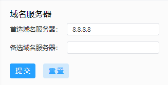

# InGateway501用户手册
## 设备简介
**待补充内容**
## 设备安装
**待补充内容**

## 概述
InGateway501（以下简称IG501）系列边缘计算网关是映翰通公司面向工业物联网领域推出的一款尺
寸小巧，紧凑型边缘网关。该产品凭借全球部署的 3G/4G 无线网络和多种宽带服
务，提供随处可得的不间断的互联网接入。以其强大的边缘计算能力、全面的安全性
和无线接入服务等特性，实现多达万级的设备联网，为真正意义上的设备信息化提供
数据的高速通路。  
IG501拥有开放式边缘计算平台，在物联网边缘节点实现数据优化、实时响应、敏捷连接、智能分析；显著减少现场与中心端的数据流量，并避免云端运算能力遇到瓶颈。优化网络架构，更安全、更快响应，同时更智能化实现现场业务。  
IG501常见的应用场景如下图所示：  

## 设备配置说明
### 访问网关
- 步骤1：IG501的FE 0/1口的默认ip地址为**192.168.1.1**，设置PC的IP地址与FE 0/1口处于同一网段。  
  - 方法一：自动获取IP地址（推荐）  

     

  - 方法二：使用固定IP地址  
    选择“使用下面的IP地址”，输入IP地址（默认为192.168.1.2~192.168.1.254中任意值）；子网掩码（默认255.255.255.0）；默认网关（默认为192.168.1.1）以及DNS服务器地址，单击<确定>。  

    

- 步骤2：打开浏览器，访问IG501的FE 0/1口IP地址并输入登录用户名和密码。设备出厂的用户名/密码默认为**adm/123456**。

- 步骤3：登录成功后，您可以看到如下图所示的网页。

### 概览
登录IG501 WEB页面后默认展示概览页面，或者选择“概览”进入此页面。你可以在此页面概览IG501的状态，包括以下内容：
- 网络连接状态：展示IG501的网络连接情况以及网络配置。
  - 外部网络状态：点击“设置”后跳转至[静态路由](#静态路由)页面。
  - 拨号网络状态：点击“设置”后跳转至[蜂窝网](#蜂窝网)页面。
  - FE 0/1网络状态：点击“设置”后跳转至[以太网](#以太网)页面。

    

- 边缘计算：展示边缘计算状态信息。  

    

- 数据使用监测：展示最近24小时的流量使用情况，每小时生成一条数据。  

    

- CPU负载：展示最近1分钟、5分钟、15分钟的CPU使用情况。  

    

- 内存：展示当前内存使用情况。  

    

- 系统信息：点击“编辑”按钮可修改IG501名称  

 

### 网络
#### 网络接口
##### 蜂窝网
**待补充内容**
##### 以太网
选择“网络 > 网络接口 > 以太网”，进入以太网界面。你可以在此页面设置和查看FE 0/1接口的网络参数。配置FE 0/1接口的步骤如下：  
1. 选择FE 0/1接口的网络类型。    
2. 依次选择或输入各项参数，参数说明见[以太网参数说明](#ethernet-parameter-description)。  
3. 单击“提交”，完成FE 0/1接口的配置。  

配置FE 0/1接口（网络类型为DHCP），如下图所示：  

  

配置FE 0/1接口（网络类型为静态IP），如下图所示：  

  

   

以太网参数说明如下：  
- 网络类型（默认为静态IP）  
  - 静态IP：手动为FE 0/1接口配置IP地址和子网掩码等信息  
  - 动态地址（DHCP）：配置接口作为DHCP客户端，使用DHCP方式获取IP地址和子网掩码等信息  
- 主IP：FE 0/1接口的IP地址，默认值为192.168.2.1。（静态IP模式时支持）  
- 子网掩码：FE 0/1接口的子网掩码。（静态IP模式时支持）  
- MTU：最大传输单元，以字节为单位，默认值为1500。（静态IP模式时支持）  
- 端口速率/端口模式（静态IP模式时支持）  
  - 自动协商
  - 100M 全双工
  - 100M 半双工
  - 10M 全双工
  - 10M 半双工
- 二层状态联动：开启后，端口没物理连接状态为 Down，有物理连接时为 UP；关闭后，端口有无物理连接时都显示 UP。（静态IP模式时支持）  
- 说明：以太网接口的描述信息，标识作用。
- 从IP支持：除主 IP 以外用户还可以配从 IP 地址，最多可以配置 10 个。（静态IP模式时支持） 

##### 环回接口
选择“网络 > 网络接口 > 环回接口”，进入环回接口界面。你可以在此页面设置和查看环回接口的网络参数。添加环回接口从IP的步骤如下：
1. 单击“从IP支持”中的“添加”按钮新增环回接口从IP（默认提供127.0.0.1的环回接口）。    
2. 依次输入IP地址和子网掩码参数。  
3. 单击“提交”，完成环回接口的配置。 

添加环回接口从IP：127.0.0.2，如下图所示：

注意：最多可以配置 10 个从IP地址。

#### 网络服务
##### DHCP服务
###### DHCP服务器
选择“网络 > 网络服务 > DHCP服务 > DHCP服务器”，进入DHCP服务器界面。你可以在此页面设置和查看DHCP服务器的配置情况。DHCP服务器配置步骤如下：  
1. 点击“添加”或“编辑”按钮配置DHCP服务。  
2. 依次配置各项参数，参数说明见[DHCP服务器参数说明](#dhcp-server-parameter-description)。  
3. 点击“确定”保存配置并点击“提交”应用配置。  

配置DHCP服务器，如下图所示：  

  

  

- DHCP服务器参数说明如下：
  - 启用DHCP服务：启用/关闭DHCP服务。注意：DHCP 服务器和 DHCP 中继不能同时被启用。
  - 接口：仅支持Fastethernet 0/1接口。
  - 起始地址：设置地址池中分配给客户端设备的起始 IP 地址。
  - 结束地址：设置地址池种分配给客户端设备的结束 IP 地址。
  - 有效期：设置分配 IP 的地址的有效期，过期 DHCP 服务器将回收分配给客户端的 IP 地址并重新分配 IP 地址，不能为空。  
- Windows名称服务器(WINS)：
- 静态IP设置：你可以通过静态IP设置来配置指定MAC地址使用固定的IP地址，如下图
  

###### DHCP中继
选择“网络 > 网络服务 > DHCP服务 > DHCP中继”，进入DHCP中继界面。你可以在此页面设置和查看DHCP中继的配置情况。DHCP中继配置步骤如下：  
1. 启用DHCP中继，需关闭DHCP服务器。  
2. 配置DHCP服务器地址和中继接口，参数说明见[DHCP中继参数说明](#dhcp-relay-parameter-description)。  
3. 点击“提交”应用配置。  

配置DHCP中继，如下图所示：  

DHCP中继参数说明如下：
- 启用DHCP中继：开启/关闭DHCP中继，不能同时启用DHCP中继和DHCP服务器
- DHCP服务器：DHCP服务器地址。
- 中继接口：作为DHCP中继的网络接口。

##### DNS服务
选择“网络 > 网络服务 > DNS服务”，进入DNS服务界面。你可以在此页面设置和查看DNS服务的配置情况。
- 域名服务器配置步骤如下：
  1. 填写DNS服务器地址。
  2. 点击“提交”应用配置。

  配置DNS服务器，如下图所示：  

- DNS中继服务配置步骤如下：
  1. 启用DNS中继服务，启用DHCP服务器时，不可关闭DNS中继服务。
  2. 点击添加按钮添加一个“[ 域名<=>IP地址 ] 对”
  3. 配置主机域名或IP地址，并配置对应的IP地址。
  4. 点击“确定”保存配置并点击“提交”应用配置。
   
  配置DNS中继服务，如下图所示：  
  

##### 主机列表
选择“网络 > 网络服务 > 主机列表”，进入主机列表界面。你可以在此页面查看已连接到IG501的主机信息，如下图所示：  

#### 静态路由
##### 静态路由状态
选择“网络 > 静态路由 > 状态”，进入静态路由状态界面。你可以在此页面查看静态路由状态信息，如下图所示：

##### 静态路由配置
选择“网络 > 静态路由 > 配置”，进入静态路由配置界面。你可以在此页面设置静态路由信息。静态路由配置步骤如下：
1. 点击“添加”按钮以添加一条静态路由配置
2. 依次配置各项参数，参数说明见[静态路由参数说明](#static-routing-parameter-description)
3. 点击“确定”保存配置并点击“提交”应用配置。

配置静态路由，如下图所示：  

静态路由参数说明如下：
- 目的网络：需要到达的目的 IP 地址
- 子网掩码：需要到达的目的地址的子网掩码
- 接口：数据到达目的网络使用的接口，用户可选择：Cellular 1、Fastethernet 0/1 
- 网关：数据在到达目的地址前，需要经过的下一个路由器 IP 地址
- 距离：即优先权，数值越小优先级越高
- Track标识：Track 的索引或 ID

#### 防火墙
##### 访问控制列表
选择“网络 > 防火墙 > 访问控制列表”，进入访问控制列表界面。你可以在此页面设置网络接口数据的过滤策略。
访问控制列表配置步骤如下：
1. 在“访问控制策略”中点击“添加”按钮添加一条访问控制策略
2. 依次配置各项参数，参数说明见[访问控制策略参数说明]()
3. 在“访问控制列表”中点击“添加”按钮或“编辑”按钮为指定接口配置访问控制
4. 依次配置各项参数，参数说明见[访问控制列表参数说明]()
5. 点击“确定”保存配置并点击“提交”应用配置。

配置标准访问控制策略，如下图所示：  
  
配置扩展访问控制策略，如下图所示：  
  
配置访问控制列表  

- 标准访问控制策略参数说明如下：
  - ID：ACL 规则ID，范围 1-99，数值越小则优先级越高
  - 序号：ACL 规则序号，数值越小则优先级越高
  - 动作：允许/拒绝报文通过
  - 源IP地址：ACL 规则匹配报文的源地址，为空时表示 any，即所有网络。
  - 源地址反掩码：ACL 规则匹配报文的源地址反掩码
  - 记录日志：启用后系统会记录关于访问控制方面的日志。
  - 说明：便于记录访问控制各项参数意义。

- 扩展访问控制策略参数说明如下：
  - ID：ACL 规则ID，范围 100-199，数值越小则优先级越高
  - 序号：ACL 规则序号，数值越小则优先级越高
  - 动作：允许/拒绝报文通过
  - 源IP地址：ACL 规则匹配报文的源地址，为空时表示 any，即所有网络。
  - 源地址反掩码：ACL 规则匹配报文的源地址反掩码
  - 源端口：源端口号，any 表示 TCP/UDP 报文的任何源端口都匹配。协议为 TCP 或 UDP 时，才可以指定源端口号。
  - 目的IP地址：ACL 规则匹配报文的目的地址，为空时表示 any，即所有网络。
  - 目的地址反掩码：ACL 规则匹配报文的源地址反掩码
  - 目的端口：目的端口号，any 表示 TCP/UDP 报文的任何目的端口都匹配。协议为 TCP 或 UDP 时，才可以指定源端口号。
  - 已建立的连接：启用后则控制已建立 TCP 连接的报文，未建立连接的 TCP 报
文不控制；未启用则控制已建立和未建立的 TCP 报文。协议为 TCP 时，才可以配置此项参数。
  - 片段：控制数据包从接口发送出去时被分片的报文。
  - 记录日志：启用后系统会记录关于访问控制方面的日志。
  - 说明：便于记录访问控制各项参数意义。

- 访问控制列表参数说明如下：
  - 接口名称：包含Cellular1和Fastethernet 0/1接口
  - 规则：选择入站、出站和管理规则

##### 网络地址转换
选择“网络 > 防火墙 > 网络地址转换”，进入访问网络地址转换界面。你可以在此页面设置网络地址转换规则。
网络地址转换规则配置步骤如下：  
1. 

### 边缘计算
### 系统管理
### 导航栏操作
#### 返回首页
#### 退出登录
#### 切换语言

## 命令行指令说明

## FAQ