# PLC Supervisor App用户手册
PLC Supervisor App（以下简称PLC Supervisor）为用户提供了便捷的数据采集、数据处理和数据上云功能，支持Snap7、ModbusRTU等多种工业协议解析。
本手册以采集PLC的数据并上传至Thingboard云平台为例说明如何通过PLC Supervisor App实现PLC数据采集和数据上云。以下将InGateway500简称为“IG500”；InGateway900简称为“IG900”。
## 1.准备硬件设备及其数据采集环境
### 1.1 硬件接线
#### 1.1.1 以太网接线
- IG900以太网接线  
  
  接通IG900的电源并按照拓扑使用以太网线连接IG900和PLC。  <br/>
  

- IG500以太网接线  
  
  接通IG500的电源并按照拓扑使用以太网线连接IG500和PLC。  <br/>

#### 1.1.2 串口接线
- IG900串口接线  

  接通IG900的电源并按照拓扑连接IG900和PLC。  <br/>
  

  IG900正上方的端子接线说明如下图：  <br/>
    

- IG500串口接线  

  接通IG500的电源并按照拓扑连接IG500和PLC。  <br/>
  

  IG500正下方的端子接线说明如下图：  <br/>
  
### 1.2 设置LAN网络参数：在局域网访问PLC
- IG900的GE 0/2口的默认IP地址为192.168.2.1。为了使IG900能够通过GE 0/2口访问以太网PLC，需要设置GE 0/2口与PLC处于同一网段，设置方法请参考[在局域网访问IG500](https://ingateway-development-docs.readthedocs.io/zh_CN/latest/IG501%E5%BF%AB%E9%80%9F%E4%BD%BF%E7%94%A8%E6%89%8B%E5%86%8C.html#lan-ig501)。
- IG500的FE 0/1口的默认IP地址为192.168.1.1。为了使IG500能够通过FE 0/1口访问以太网PLC，需要设置FE 0/1口与PLC处于同一网段，设置方法请参考[在局域网访问IG900](https://ingateway-development-docs.readthedocs.io/zh_CN/latest/IG902%E5%BF%AB%E9%80%9F%E4%BD%BF%E7%94%A8%E6%89%8B%E5%86%8C.html#lan-ig902)。

### 1.3 设置WAN网络参数：传输数据至MQTT服务器
- 设置IG500 WAN网络参数，请参考[IG500连接Internet](https://ingateway-development-docs.readthedocs.io/zh_CN/latest/IG501%E5%BF%AB%E9%80%9F%E4%BD%BF%E7%94%A8%E6%89%8B%E5%86%8C.html#wan-internet)。
- 设置IG900 WAN网络参数，请参考[IG900连接Internet](https://ingateway-development-docs.readthedocs.io/zh_CN/latest/IG902%E5%BF%AB%E9%80%9F%E4%BD%BF%E7%94%A8%E6%89%8B%E5%86%8C.html#wan-internet)。

### 1.4 更新InGateway设备软件版本
如需获取InGateway产品最新软件版本及其功能特性信息，请联系客服。如需更新软件版本，请参考如下链接：
- [更新IG500软件版本](https://ingateway-development-docs.readthedocs.io/zh_CN/latest/IG501%E5%BF%AB%E9%80%9F%E4%BD%BF%E7%94%A8%E6%89%8B%E5%86%8C.html#id1)
- [更新IG900软件版本](https://ingateway-development-docs.readthedocs.io/zh_CN/latest/IG902%E5%BF%AB%E9%80%9F%E4%BD%BF%E7%94%A8%E6%89%8B%E5%86%8C.html#id1)

## 2.配置PLC Supervisor App
### 2.1 安装并运行PLC Supervisor
- IG500如何安装并运行Python App请参考[IG500安装和运行Python App](https://ingateway-development-docs.readthedocs.io/zh_CN/latest/IG501%E5%BF%AB%E9%80%9F%E4%BD%BF%E7%94%A8%E6%89%8B%E5%86%8C.html#python-app)，PLC Supervisor正常运行后如下图所示：  
  

- IG900如何安装并运行Python App请参考[IG900安装和运行Python App](https://ingateway-development-docs.readthedocs.io/zh_CN/latest/IG902%E5%BF%AB%E9%80%9F%E4%BD%BF%E7%94%A8%E6%89%8B%E5%86%8C.html#python-app)，PLC Supervisor正常运行后如下图所示： 
  

### 2.2 PLC Supervisor数据采集配置
#### 2.2.1 添加PLC设备
- 添加S7通讯的PLC设备  
  
  点击“添加PLC”按钮，在添加设备页面选择PLC协议为“Snap7”并配置PLC的通讯参数。（机架号和槽号除S7-200 Smart需要配置为0，1；其余类型的S7系列PLC默认使用0，0即可）  

  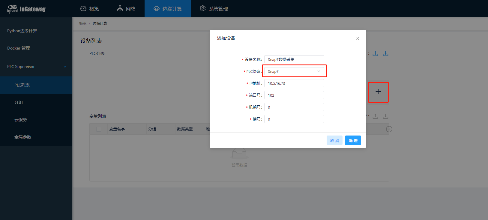  
添加成功后如下图所示：  
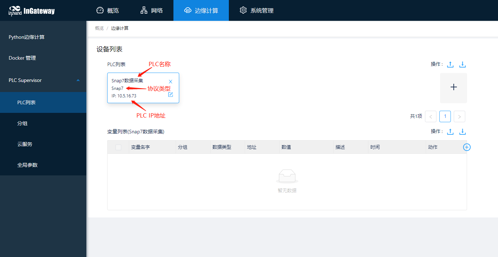
- 添加ModbusTCP通讯的PLC设备  
  
  点击“添加PLC”按钮，在添加设备页面选择PLC协议为“ModbusTCP”并配置PLC的通讯参数。（端口号和字节序默认为502和abcd；使用时需根据实际情况调整）  

  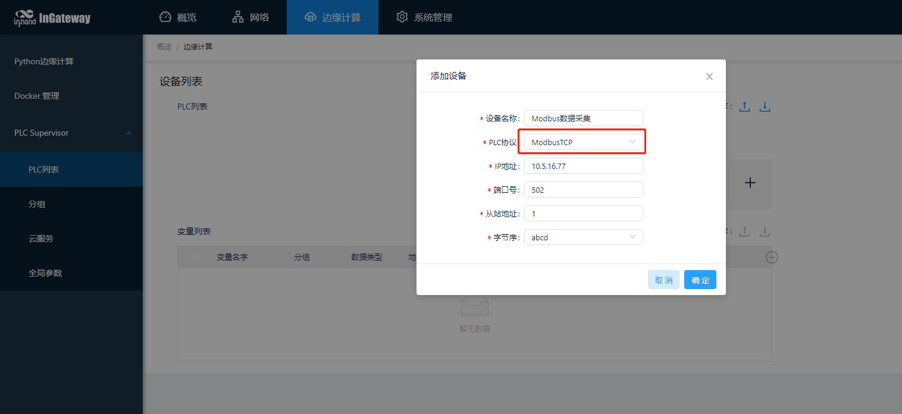
  添加成功后如下图所示：  
  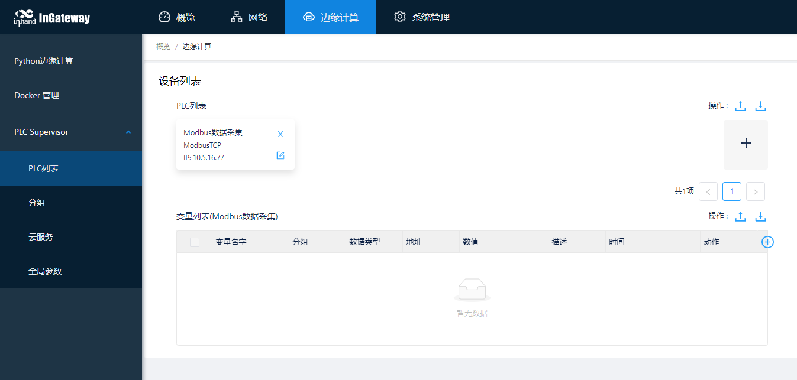
- 添加ModbusRTU通讯的PLC设备  
  
  点击“添加PLC”按钮，在添加设备页面选择PLC协议为“ModbusRTU”并配置PLC的通讯参数。  

  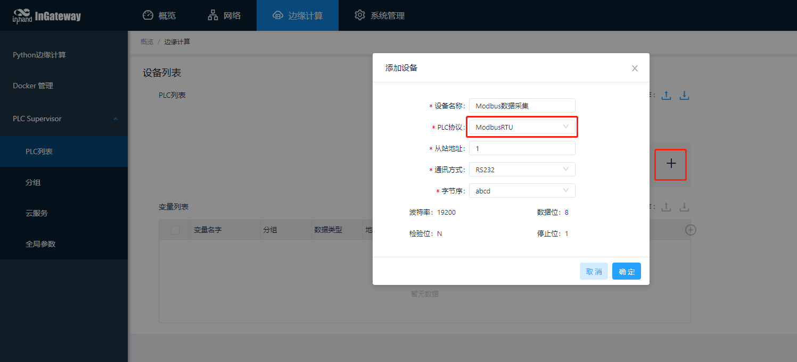  
添加成功后如下图所示：
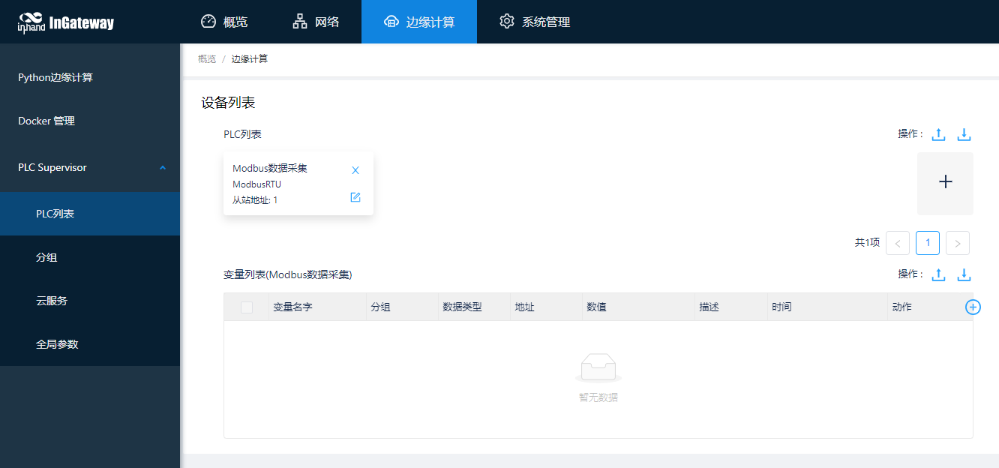  

  如需修改RS232/RS485的通讯参数，请在“边缘计算>>PLC Supervisor>>全局参数”页面修改。  
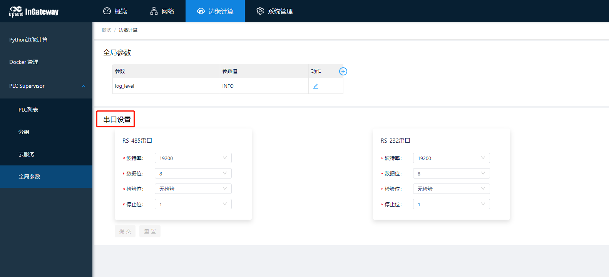
#### 2.2.2 添加变量
- 添加Snap7变量  
  
  点击“添加变量”按钮，在添加变量弹出框中配置PLC变量参数：
  - 变量名：变量名称    
  - 寄存器类型：变量寄存器类型，包括I/Q/M/DB  
  - DB索引：寄存器类型为DB时变量的DB号  
  - 地址：变量的偏移地址  
  - 数据类型：变量数据类型，包括：  
    - BOOL：True或False  
    - BIT：0或1  
    - BYTE：8位无符号数据  
    - SINT：8位有符号数据  
    - WORD：16位无符号数据  
    - INT：16位有符号数据  
    - DWORD：32位无符号数据  
    - DINT：32位有符号数据  
    - FLOAT：32位浮点数  
    - STRING：8位字符串  
    - BCD ：16位BCD码  
  - 小数位：数据类型为FLOAT时变量小数点后的数据长度，最大6位  
  - 长度：数据类型为STRING时字符串长度  
  - 位：数据类型为BOOL或BIT时变量的位偏移，可输入0~7中任一数字  
  - 读写权限：  
    - Read：只读，不可写  
    - Write：只写，不可读  
    - Read/Write：可读可写  
  - 采集模式：  
    - Realtime：按照固定采集间隔采集变量并按照上报间隔上报数据  
    - Onchange：变量数值变化后才采集并按照上报间隔上报数据  
  - 单位：变量单位  
  - 描述：变量描述  
  - 所属分组：变量所属的采集组  
  下图是添加一个地址为%I0.0的开关变量的例子：
  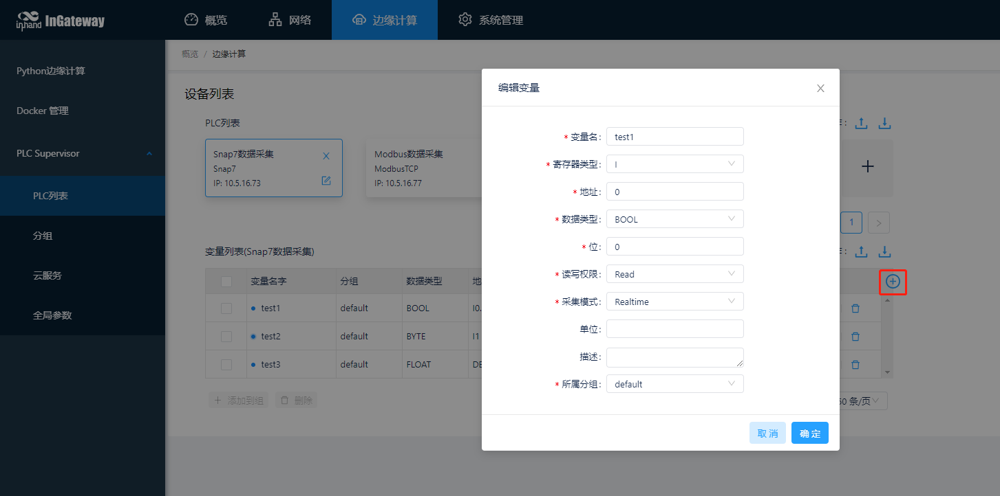  
  下图是添加一个地址为%IB1的字节变量的例子：  
  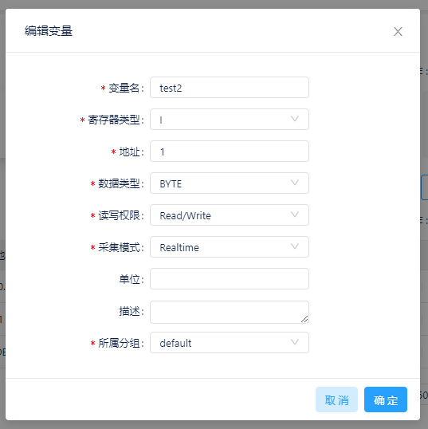  
  下图是添加一个地址为%IW3的字变量的例子：  
  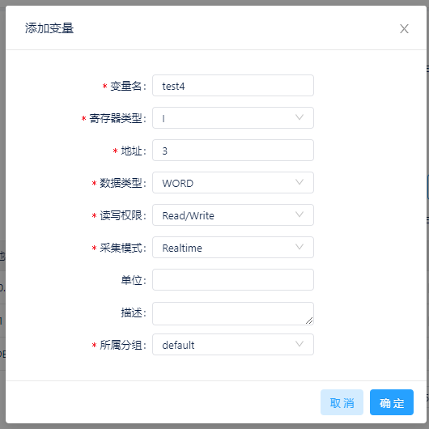  
  下图是添加一个地址为%ID4的字变量的例子：  
  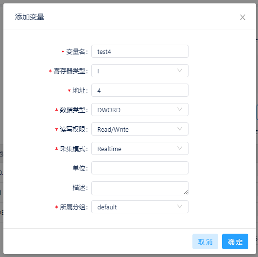  
  下图是添加一个地址为%DB6.DBD18的浮点数变量的例子：
  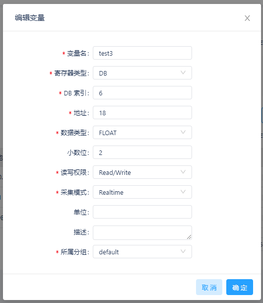  

- 添加Modbus变量
点击“添加变量”按钮，在添加变量弹出框中配置PLC变量参数：
  - 变量名：变量名称  
  - 地址：变量的偏移地址  
  - 数据类型：变量数据类型，包括：  
    - BOOL：True或False  
    - BIT：0或1  
    - WORD：16位无符号数据  
    - INT：16位有符号数据  
    - DWORD：32位无符号数据  
    - DINT：32位有符号数据  
    - FLOAT：32位浮点数  
    - STRING：8位字符串   
  - 小数位：数据类型为FLOAT时变量小数点后的数据长度，最大6位  
  - 长度：数据类型为STRING时字符串长度  
  - 位：地址为30001~40000.310001~365535，40001~50000，410001~465535且数据类型为BOOL或BIT时变量的位偏移，可输入0~15中任一数字  
  - 读写权限：  
    - Read：只读，不可写  
    - Write：只写，不可读  
    - Read/Write：可读可写  
  - 采集模式：  
    - Realtime：按照固定采集间隔采集变量并按照上报间隔上报数据  
    - Onchange：变量数值变化后才采集并按照上报间隔上报数据  
  - 单位：变量单位  
  - 描述：变量描述  
  - 所属分组：变量所属的采集组  
  
  下图是添加一个地址为00001线圈变量的例子：
  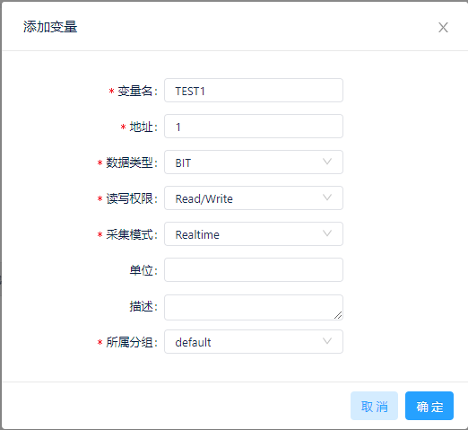  

  下图是添加一个地址为10001开关变量的例子：
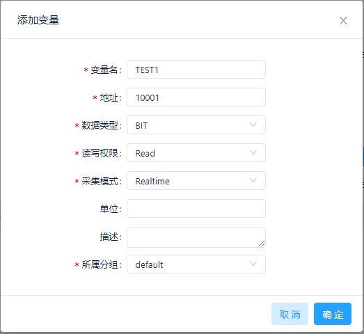  

  下图是添加一个地址为30001整数变量的例子：
  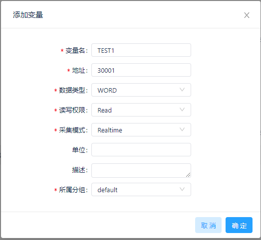  

  下图是添加一个地址为40001浮点数变量的例子：
  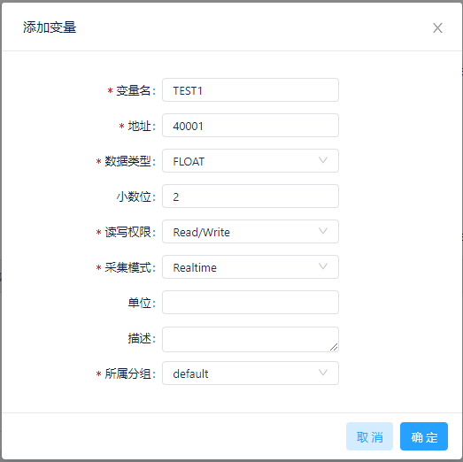
#### 2.2.3 配置变量分组
如需为变量配置不同的采集间隔和上报间隔或者需要按照不同的MQTT主题上报变量数据时，可在“边缘计算>>PLC Supervisor>>分组”页面添加分组。  
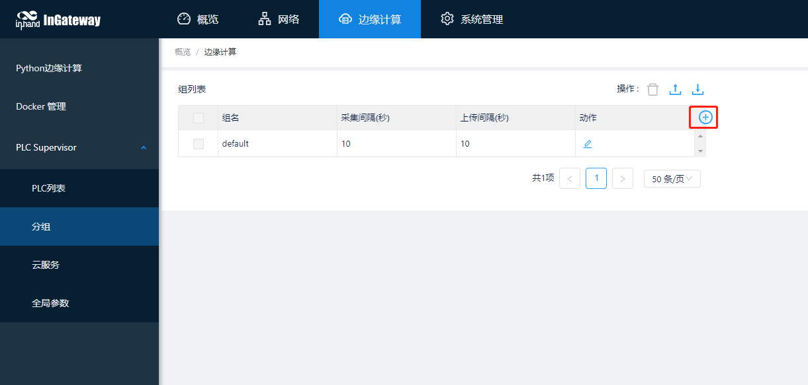

添加分组后，添加变量时可以选择将变量关联到该分组或者在变量列表中选择需要关联的变量添加到指定分组中。
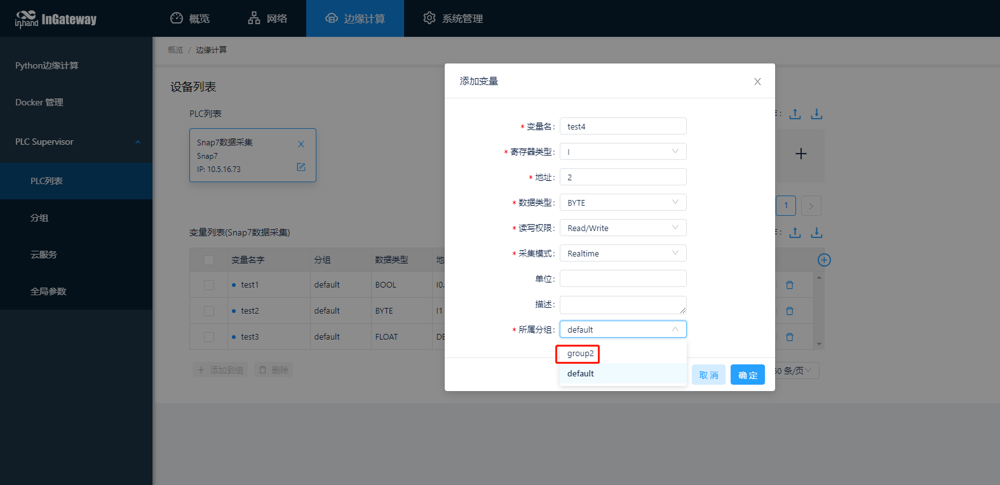  

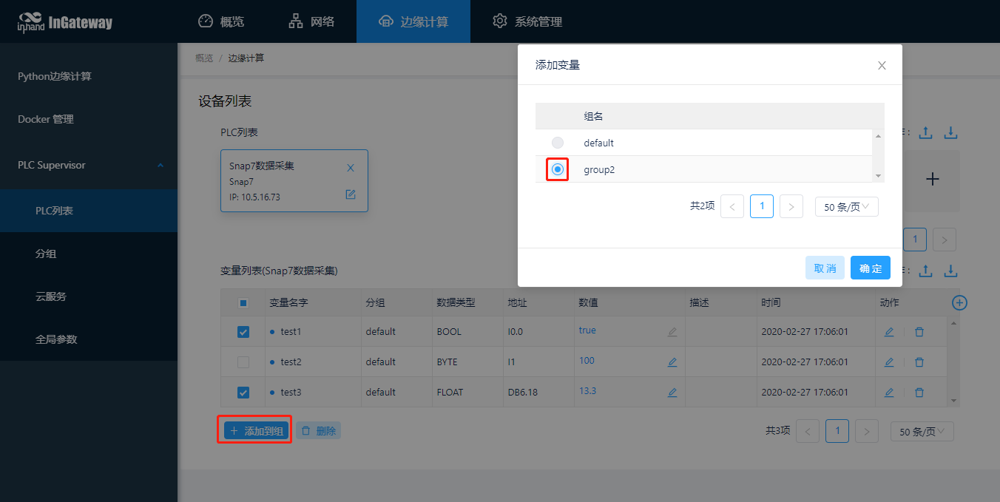
#### 2.2.3 监控PLC数据

## 3.监控PLC数据
### 3.1 本地监控PLC数据
数据采集配置完成后，可以在“边缘计算>>PLC Supervisor>>PLC列表”页面查看数据采集情况
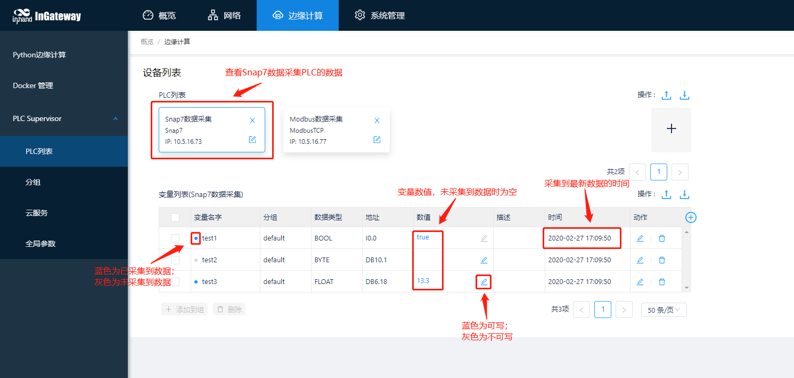
### 3.2 在Thingsboard上监控PLC数据
#### 3.2.1 配置云服务
进入“边缘计算>>PLC Supervisor>>云服务”页面，勾选启用云服务并配置相应的MQTT连接参数，配置完成后点击提交。
- 服务器地址：demo.thingsboard.io
- 端口号：1883
- MQTT客户端ID：任一唯一ID
- MQTT用户名：Thingsboard设备的访问令牌，访问令牌获取方式见[Thingsboard设备令牌]()
- MQTT密码：任意6~32位密码
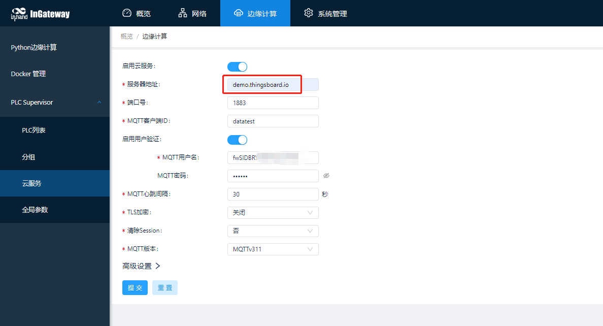

提交后点击“高级设置”以配置发布和订阅主题。发布和订阅主题的配置方法请参考[自定义函数]()
- 发布主题：
  - 主题：v1/devices/me/telemetry
  - Qos(MQTT)：1
  - 分组：需要上传至thingsboard的数据
  - 主函数：入口函数名称
  - 函数实现：
    ```python
    from common.Logger import logger

    def test_upload(recv, global_argv, mqtt_publish, save_db):
      value_dict = {}
      for id, val in recv['values'].items():
          value_dict[id] = val["raw_data"]
      value_dict["timestamp"] = recv["timestamp"]
      logger.info("*" * 100)
      logger.info(value_dict)
      return value_dict
    ```

- 订阅主题
  - 主题：v1/devices/me/rpc/request/+
  - Qos(MQTT)：1
  - 主函数：入口函数名称
  - 函数实现：
    ```python
    from common.Logger import logger
    import json
    
    def test_ctl(topic, payload, send_message_to_partner=None):
        logger.info("#" * 100)
        logger.info(topic)
        logger.info(payload)
        payload = json.loads(payload)
        if payload["method"] == "setValue":
            message = {"Bool_data":float(payload["params"])}
            response_data = [topic.replace('request', 'response'), message]
            send_message_to_partner(message, "write_plc_values", ack, response_data)
    
    def ack(data, tail, mqtt_publish):
        resp_data = tail[1]
        mqtt_publish(tail[0], json.dumps(resp_data), 0)
        print(tail[0])
    ```
#### 3.2.2 配置Thingsboard
Thingsboard的配置方法可以参考[Thingsboard入门手册](https://thingsboard.io/docs/getting-started-guides/helloworld/)，也可以参考以下流程：  

- 步骤1：添加设备和资产  
  
  访问https://demo.thingsboard.io/login，输入登录账号和密码。如果未注册过账号则需要先注册账号后再登录。
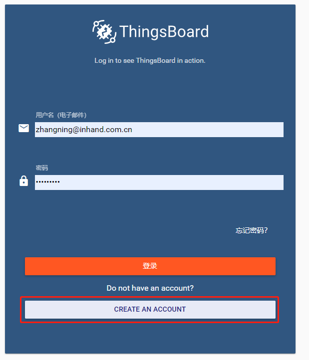  <br/>

  登录后，进入属性页面修改语言为简体中文


  - 添加一个资产
    

      

    添加成功后如下图所示：  <br/>

      
&nbsp;

  - 添加一个设备
  

      
&nbsp;

  建立资产与设备的关联
  

  添加完成后如下图所示
  
&nbsp;

- 步骤2：传输PLC数据到设备  
  
  资产和设备配置完成后，复制已添加设备的访问令牌并粘贴至网关的云服务页面的用户名参数中以将数据传输至Thingsboard中的Snap7设备。
  

  随后可在设备的最新遥测中查看已上传的数据。


- 步骤3：配置可视化仪表板  
  - 添加仪表板  
  
    点击添加仪表板，选择创建新的仪表板
  
    
      
&nbsp;

  添加完成后单击配置仪表板
  

  点击进入编辑模式
  

  为仪表板添加实体别名
  

  在添加别名页面按下图配置：
  

  配置完成后保存配置。
  

  保存后，为仪表板中添加部件。


  - 添加趋势图  
  
    在部件中选择Charts并点击Timeseries-Flot。
  

    在图表的数据页面为趋势图添加展示数据。
  

    
添加完成后如下图所示：


  - 添加开关  
  
    点击添加，选择创建新部件以添加一个控制开关。
  

    在部件中选择Control widgets并点击Switch control。
  

    随后选择目标设备。


  配置完成后调整部件的大小和布局并保存。

随后可以通过开关下发控制命令以及通过趋势图查看数据趋势。


# 附录
## 导入导出配置
## 自定义数据格式
您可使用云服务中的高级设置功能配置MQTT主题、上报数据等参数并支持使用Python语言自定义MQTT发布和订阅主题的数据上报、处理逻辑。无需二次开发即可实现与多种纯MQTT服务器进行数据上传和下发。

### 发布
自定义发布中包含以下项：
- 发布名称：自定义发布名称
- 发布主题：与MQTT服务器订阅的数据主题一致
- Qos(MQTT)：建议与MQTT服务器的Qos一致
- 分组：选中分组后，分组下所有变量通过该发布主题和函数实现将变量数据上传至MQTT服务器（可选择多个分组）
- 主函数名称：即入口函数名称，与函数实现中的入口函数名称保持一致
- 函数实现：使用Python代码自定义组包和处理逻辑，主函数的参数包括：
  - data：PLC Supervisor采集到的变量数据，数据类型为dict。数据格式如下  
    ```python
    {
      "timestamp": 1583292673.516777, #数据产生时间戳
      "group_name": "default" #分组名称
      "values": { #数据字典，包括PLC名称，变量名称和变量值等数据
        "S7-1200": { #PLC名称
          "Test1": { #变量名称
            "raw_data": false,  #真实数据
            "str_data": "False",  #字符串格式的真实数据
            "status": 1 #采集状态，非1即为采集异常
          }, 
          "Test2": {
            "raw_data": 13.300000000000001, 
            "str_data": "13.300000000000001", 
            "status": 1
          }
        }
      },  
    }
    ```
  - global_argv：全局参数页面中配置的全局参数项，数据类型为dict。默认如下
    ```python
    {
      "log_level": "INFO",  #日志等级
      "gateway_sn": "xxxxxx" #网关序列号
    }
    ```
  - mqtt_publish：MQTT发布消息方法，用于将指定数据发送到相应的主题并返回发送结果：成功（True），失败（False）。方法参数包含：
    - topic：发送数据值该主题
    - payload：需要发送的数据
    - qos：qos等级（1，2，3）
  - save_data：存储历史数据方法，采用队列的方式存储数据。方法参数包含：
    - data：需要存储的数据
    - group_name：组名
    - userdate：默认为None

以下是两个常见的自定义发布方法用例：
- 用例1（使用return方式上传数据）：
  ```python
  import logging
  
  def test_upload(data, global_argv, mqtt_publish=None, save_data=None): #定义发布主函数
      value_list = [] #定义数据列表
      for device, val_dict in data['values'].items(): #遍历values字典，该字典中包含设备名称和设备下的变量数据
          value_dict = { #自定义数据字典
                        "Device": device,
                        "timestamp": data["timestamp"],
                        "Data": {}
                        }
          for id, val in val_dict.items(): #遍历变量数据，为Data字典赋值
              value_dict["Data"][id] = val["raw_data"]
          value_list.append(value_dict) #依次将设备名称和设备的数据添加到value_list中
      logging.info(value_list) #在App日志中打印value_list
      return value_list #将value_list发送给App，App将自行按照采集时间顺序上传至MQTT服务器。如果发送失败则缓存数据等待连接恢复后按时间顺序上传至MQTT服务器
    ```  
  最终上传至平台的数据格式(value_list)如下：
  ```python
  [
    {
      'Device': 'Modbus', 
      'timestamp': 1583462030.720562, 
      'Data': {'TT1': 4}
      }, 
    {
      'Device': 'S7-1200', 
      'timestamp': 1583462030.720562, 
      'Data': {'Test1': False}
      }
  ]
  ```
- 用例2（使用mqtt_publish上传数据并使用save_data存储上传失败的数据。上传失败的数据会在连接正常时按时间顺序依次上传）：
  ```python
  import logging
  import json
  
  def test_upload(recv, global_argv, mqtt_publish=None, save_data=None): #定义发布主函数
      value_list = [] #定义数据列表
      for device, val_dict in recv['values'].items(): #遍历values字典，该字典中包含设备名称和设备下的变量数据
          value_dict = { #自定义数据字典
                        "DeviceSN": device,
                        "Time": recv["timestamp"]
                        "Data": {}
                         }
          for id, val in val_dict.items(): #遍历变量数据，为Data字典赋值
              value_dict["Data"][id] = val["raw_data"]
          value_list.append(value_dict) #依次将设备名称和设备的数据添加到value_list中
      if not mqtt_publish("v1/xxx/yyy", json.dumps(value_list), 1): #调用mqtt_publish方法将value_list数据通过主题“v1/xxx/yyy”，qos等级1发送至MQTT服务器并检测是否发送成功
          save_db(value_list, recv["group_name"]) #发送失败则存储数据，等待连接恢复后将按时间顺序上传存储数据
      logger.info(value_list) #在App日志中打印value_list
  ```
  最终上传至平台的数据格式(value_list)如下：
  ```python
  [
    {
      'Device': 'Modbus', 
      'timestamp': 1583462030.720562, 
      'Data': {'TT1': 4}
      }, 
    {
      'Device': 'S7-1200', 
      'timestamp': 1583462030.720562, 
      'Data': {'Test1': False}
      }
  ]
  ```
### 订阅
自定义订阅中包含以下项：
- 订阅名称：自定义名称
- 订阅主题：与MQTT服务器订阅的数据主题一致
- Qos(MQTT)：建议与MQTT服务器的Qos一致
- 主函数名称：与函数实现中的主函数名称保持一致
- 函数实现：使用Python代码自定义组包和处理逻辑，主函数的参数包括
  - topic：订阅的主题，数据类型为string
  - payload：订阅的数据，数据类型为string（一般为json字符串）
  - send_message_to_partner：将接收到的数据发给指定服务的方法

send_message_to_partner方法参数(系统方法)：
- message：需要发送给指定服务的数据，数据类型为dict。当参数operate为"write_plc_values"时消息格式如下
  ```python
  {
    "test1":12.3 #变量名:值
    "test2":"True"
  }
  ```
- operate：目前仅支持"write_plc_values"，用于写入数据到PLC变量
- ack_callback：调用ack方法，一般用于将数据下发结果返回给平台。默认值None
- ack_tail：ack方法的特殊参数，一般用于将下发数据中需要返回给平台的特殊数据传给ack方法。
- timeout：超时时间，默认为60秒

自定义ack_callback方法参数：
- message: send_message_to_partner方法中的message数据
- tail：send_message_to_partner方法中的ack_tail数据
- mqtt_publish：MQTT发布消息方法（可能受网络影响导致发布失败）

以下是三个常见的自定义订阅方法用例：
- 用例1：下发变量名称和变量值写入PLC数据且不返回写入结果
```python
import logging
import json

def test_ctl(topic, payload, send_message_to_partner=None): #定义订阅主函数
    logger.info(topic) #打印订阅主题
    logger.info(payload) #打印订阅数据
    #假定payload数据为{"method":"setValue", "TagName":SP1, "TagValue":12.3}
    payload = json.loads(payload) #反序列化订阅数据
    if payload["method"] == "setValue": #检测是否为写入数据
        message = {payload["TagName"]:payload["TagValue"]} #定义下发消息，包括下发的变量名称和变量值
        send_message_to_partner(message, "write_plc_values") #调用send_message_to_partner方法，将message字典中的数据下发至指定变量
```
- 用例2：下发设备名称，变量名称和变量值写入PLC数据且不返回写入结果
```python
import logging
import json

def test_ctl(topic, payload, send_message_to_partner=None): #定义订阅主函数
    logger.info(topic) #打印订阅主题
    logger.info(payload) #打印订阅数据
    #假定payload数据为{"method":"setValue","Device":"Modbus_test", "TagName":SP1, "TagValue":12.3}
    payload = json.loads(payload) #反序列化订阅数据
    data_dict = {payload["TagName"]:payload["TagValue"]} #定义下发的数据字典，包含下发的变量名称和变量值
    var_device = payload["Device"] #定义设备名称
    if payload["method"] == "setValue": #检测是否为写入数据
        message = {var_device:data_dict} #定义下发消息，包括设备名称和下发的数据字典
        send_message_to_partner(message, "write_plc_values") #调用send_message_to_partner方法，将message字典中的数据下发至指定变量
```
- 用例3：远程写入PLC数据并返回写入结果
```python
import logging
import json

def test_ctl(topic, payload, send_message_to_partner=None): #定义订阅主函数
    logger.info(topic) #打印订阅主题
    logger.info(payload) #打印订阅数据
    #假定payload数据为{"method":"setValue","Device":"Modbus_test", "TagName":SP1, "TagValue":12.3}
    payload = json.loads(payload) #反序列化订阅数据
    data_dict = {payload["TagName"]:payload["TagValue"]} #定义下发的数据字典，包含下发的变量名称和变量值
    var_device = payload["Device"] #定义设备名称
    if payload["method"] == "setValue": #检测是否为写入数据
        message = {var_device:data_dict} #定义下发消息，包括设备名称和下发的数据字典
        ack_data = [topic.replace('request', 'response'), message] #定义确认数据，包括响应的主题和消息
        send_message_to_partner(message, "write_plc_values", ack, ack_data) #调用send_message_to_partner方法，将message字典中的数据下发至指定变量；调用ack方法并发送ack_data给ack方法

def ack(data, tail, mqtt_publish): #定义ack方法
    '''
    data为写入结果数据，如果data为空，则说明写入超时。写入成功时data格式如[{"value": 123, "var_name": "QQQ", "result": "OK"}]；写入失败时result为"Failed"。
    '''
    topic = tail[0] #定义响应主题
    if data:
        resp_data = {"Status":"timeout", "Data":tail[1]}
    else:
        resp_data = {"Status":data["result"], "Data":tail[1]}
    mqtt_publish(topic, json.dumps(resp_data), 0) #调用mqtt_publish将resp_data发送给MQTT服务器
```

