# **第一章 快速入门**

## 第一节 搭建开发环境
### 1. 准备InGateway硬件设备及其网络环境
#### 1.1 接通InGateway设备电源并使用网线连接PC
接通InGateway设备的电源并按照拓扑使用以太网线连接PC和InGateway设备。

#### 1.2 设置LAN网络参数：在局域网访问Gateway设备
- 步骤1：InGateway设备的FE 0/1口的默认ip地址为192.168.1.1，设置PC的IP地址与FE 0/1口处于同一网段。  
   - 方法一：自动获取IP地址（推荐）  
     
&nbsp;

   - 方法二：使用固定IP地址，设置PC和InGateway设备FE 0/1口处于同一网段。选择“使用下面的IP地址”，输入IP地址（默认为192.168.1.2~192.168.1.254中任意值）；子网掩码（默认255.255.255.0）；默认网关（默认为192.168.1.1）以及DNS服务器地址，单击<确定>。  
  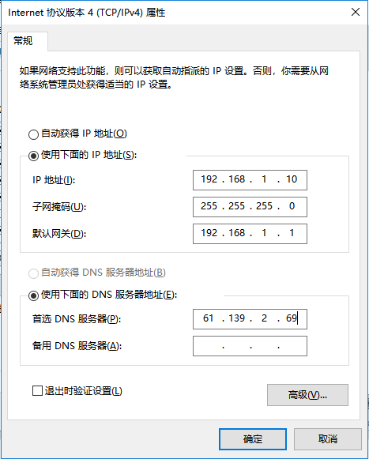   
&nbsp;

- 步骤2：打开浏览器，访问InGateway设备FE 0/1口IP地址并输入登录用户名和密码。设备出厂的用户名/密码默认为adm/123456。
   
 &nbsp;

- 步骤3：登录成功后，您可以看到如下图所示的网页。
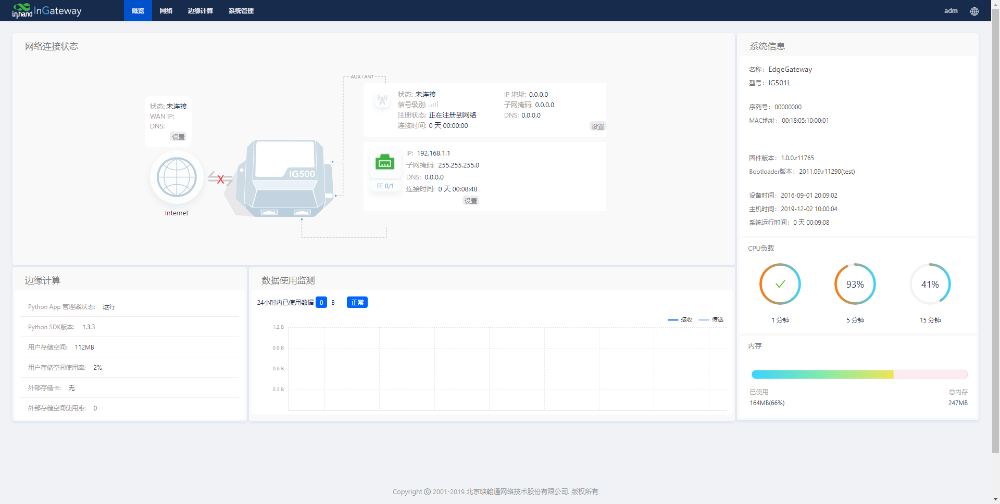   
 &nbsp;

- 步骤4：如需修改登录InGateway设备web管理界面的用户名和密码可进入“系统管理”>>“用户管理”页面设置新的用户名和密码。
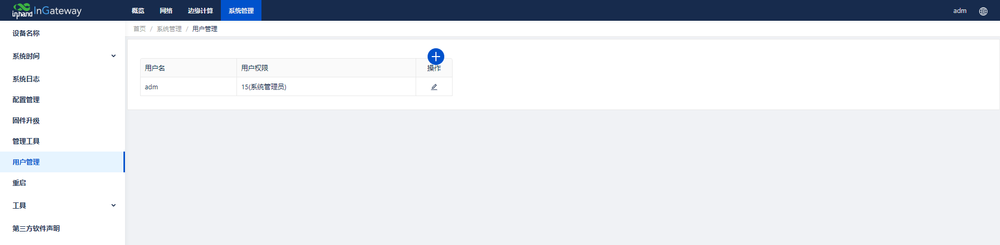   
&nbsp;

- 步骤5：如需修改FE 0/1口的IP地址可访问“网络”>>“以太网接口”>>“配置以太网0/1”页面进行修改。
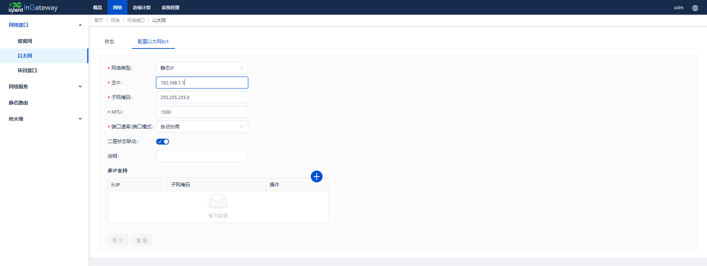   

#### 1.3 设置InGateway连接Internet
- 步骤1：将SIM卡插入卡槽（注意：插拔SIM卡操作时，必须拔掉电源，以免造成数据丢失或设备损坏）。插入SIM卡后将4G LTE天线与ANT口连接，接通InGateway设备的电源。

    
 &nbsp;

- 步骤2：进入“网络>>网络接口>>蜂窝网>>配置蜂窝网”页面，勾选“启用拨号”并点击提交。
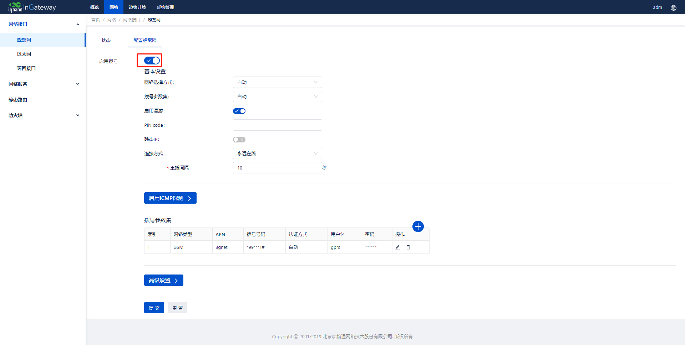
&nbsp;

  待网络连接状态显示为“连接”并且显示已分配相应IP地址等状态时说明InGateway设备已通过SIM卡联网。  


#### 1.4 更新软件版本
如需获取InGateway产品最新软件版本及其功能特性信息，请联系客服。如需更新InGateway设备的固件或Python SDK版本，请参考如下方法。
- 更新InGateway设备固件版本  
  点击“系统管理”>>“固件升级”，选择相应的固件文件后点击“开始升级”。InGateway设备升级完成后，会提示重启设备以应用新的固件。
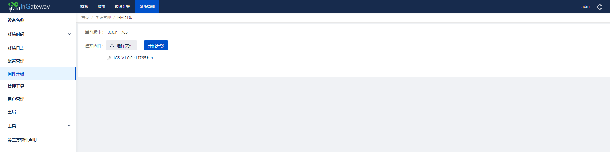
 &nbsp;

- 更新InGateway设备Python SDK版本  
进入“边缘计算”>>“Python边缘计算”>>“引擎”页面，勾选“Python边缘计算引擎”并选择相应的SDK文件点击“升级”，InGateway设备会自动完成升级操作。
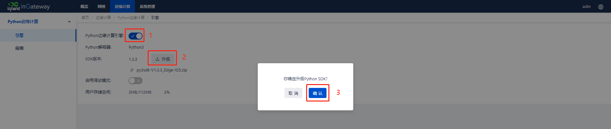

#### 1.5 启用InGateway设备的调试模式
开发过程中，为了在InGateway设备上运行并调试Python代码，需要启用InGateway设备的调试模式。在“边缘计算”>>“Python边缘计算”>>“引擎”页面中，勾选“启用调试模式”，启用后可通过VS Code对InGateway设备进行开发。
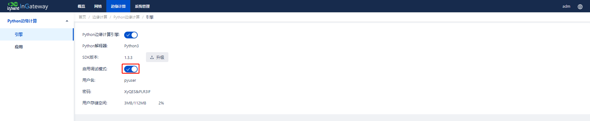
 &nbsp;

启用调试模式后，InGateway启动一个SSH Server，监听LAN网络(默认IP地址192.168.1.1)的222端口。SSH Server的用户名和密码将被显示到上述网页中。为了提高安全性，每次开启调试模式或重启设备，都会重新随机生成新的密码。

### 2. 安装PC上需要的软件
#### 2.1 安装Python解释器
在开发过程中PC需具备Python2.7.X或3.7.X解释器（建议使用3.7.X解释器），您可以访问 https://www.python.org/downloads/ 下载相应的安装包并安装至PC。
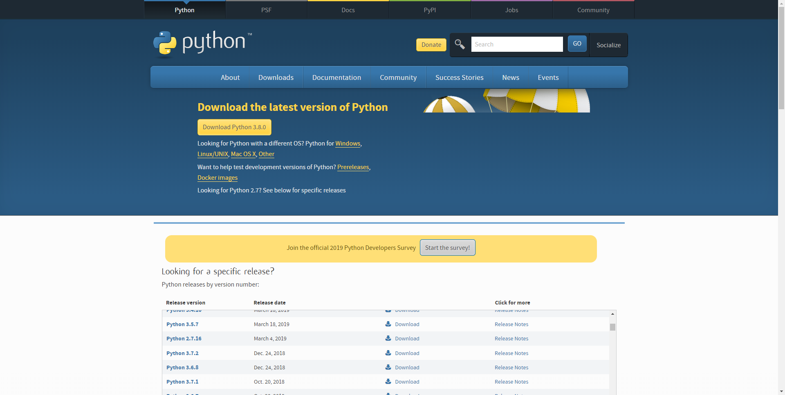

#### 2.2 安装Visual Studio Code软件
您可以访问：https://code.visualstudio.com/Download 获取相应的Visual Studio Code软件（以下简称VS Code）。

 &nbsp;

下载完成后运行安装程序，安装成功后打开VS Code软件，软件页面如下图。

### 3. 准备VS Code开发环境
#### 3.1 安装VS Code扩展插件
为了在InGateway设备上开发并调试Python代码，您要在VS Code IDE的“Extensions”中安装以下必需的扩展插件：  
- `Python`：一个拥有丰富的功能特性的VS Code Python扩展插件，包括诸如IntelliSense、linting、调试、代码导航、代码格式化、Jupyter笔记本支持、重构、变量资源管理器、测试资源管理器、代码片段等功能！想要了解跟多详细信息，请访问该插件的[官方网页](https://code.visualstudio.com/docs/languages/python)。  
- `Project Templates`：一个支持基于自定义模板快速创建新项目的VS Code扩展插件。我们会发布若干Python App模板，您可以使用Project Templates导入模板，并快速初始化项目。  
- `SFTP`：您可以使用SFTP Sync插件将代码上传至InGateway设备中。


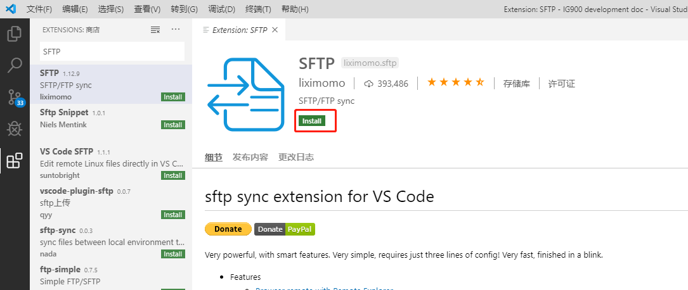  
 &nbsp;

至此，InGateway设备边缘计算平台（以下简称“MobiusPi”）开发所必需的插件安装完成。想要了解更多VS Code插件，请访问[Visual Studio Code官网](https://code.visualstudio.com/)。

#### 3.2 配置Python解释器版本
使用快捷键：`Ctrl+Shift+P`弹出命令面板，在命令面板中输入`>Python: select Interpreter`。

 &nbsp;

根据需要选择相应的Python解释器，本教程使用3.7.X版本的Python解释器（所选择的Python解释器版本应同“边缘计算”>>“Python边缘计算”>>“引擎”页面的Python解释器一致）。选择后在VS Code左下角可以看到已选择的Python解释器版本。
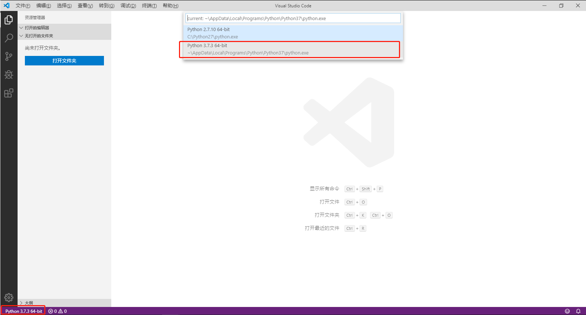

#### 3.3 配置工程模板
##### 3.3.1 使用映翰通标准工程模板
- 步骤1：请从[这里](https://github.com/inhandnet/MobiuspiProjectTemplates/releases)下载MobiusPi工程模板。  
MobiusPi提供多种工程模板以方便您快速初始化工程目录。各工程模板的详细说明请参考[这里](https://github.com/inhandnet/MobiuspiProjectTemplates/blob/master/README.md)。本教程使用标准工程模板“helloworld-template”进行演示说明。  
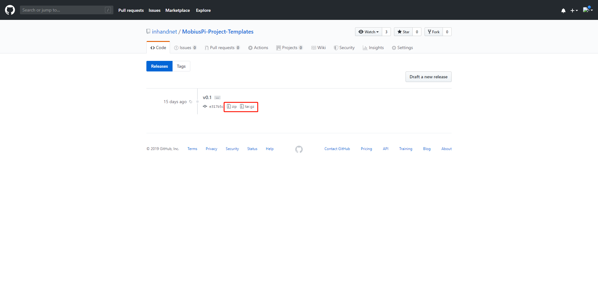
 &nbsp;

- 步骤2：打开工程模板。  
解压下载后的工程模板压缩包，使用VS Code打开解压文件夹中的helloworld-template文件夹，点击“文件”>>“打开文件夹”并选择的“helloworld-template”文件夹。
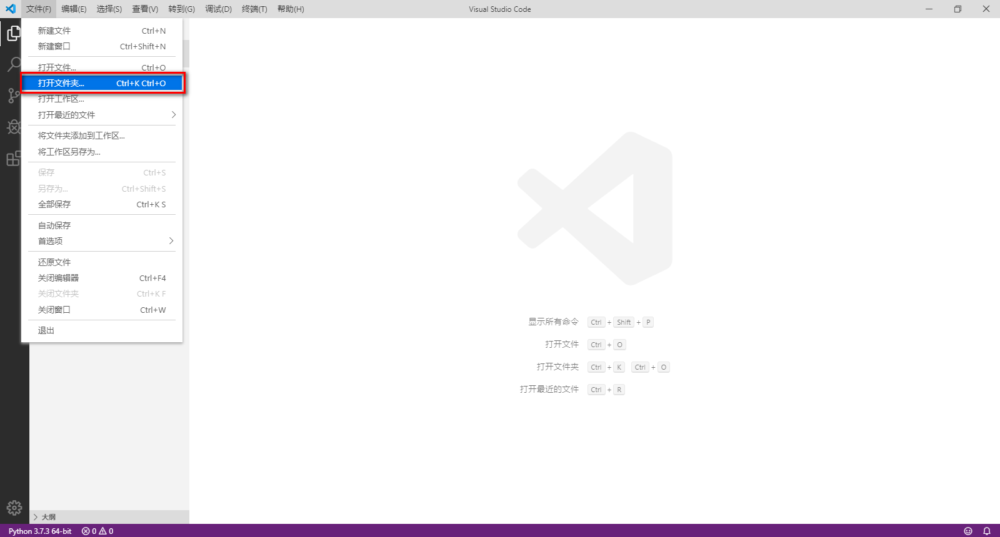
 &nbsp;

  打开工程模板文件夹“helloworld-template”后如下图所示，工程模板中包含以下内容：
  - `.vscode`：VS Code配置文件夹
    - `sftp.json`:SFTP插件的配置文件，用于与InGateway设备建立SFTP连接
  - `build`：APP发布包文件夹
  - `src`：APP源码文件夹
    - `main.py`：APP入口
    - `parse_config.py`:解析APP配置文件
  - `config.yaml`：APP配置文件
  - `setup.py`:APP版本、SDK版本等信息说明

  
 &nbsp;

- 步骤3：在命令面板中输入`>Project:Save Project as Template`命令以将当前工程文件存为模板。

 &nbsp;

  定义您模板的名称，如：helloworld-template。


##### 3.3.2 自定义工程模板
- 步骤1：新建一个工程模板文件夹，文件夹中必须包含以下内容。其他文件可根据您的实际情况自行添加
  - `.vscode`：VS Code配置文件夹（在VS Code的命令面板中输入`>SFTP:Config` 命令可快速创建.vscode文件夹和sftp.json文件）
    - `sftp.json`:SFTP插件的配置文件，用于与InGateway设备建立SFTP连接
  - `build`：APP发布包文件夹
  - `src`：APP源码文件夹
    - `main.py`：APP入口
  - `config.yaml`：APP配置文件，内容可自定义
  - `setup.py`:APP版本、SDK版本等信息说明，建议参照标准模板定义
   &nbsp;

- 步骤2：打开工程模板。
  使用VS Code打开自定义工程模板文件夹，点击“文件”>>“打开文件夹”并选择的自定义工程模板文件夹。详细说明请参考[3.3.1 使用映翰通标准工程模板](#331-使用映翰通标准工程模板)
 &nbsp;

- 步骤3：在命令面板中输入`>Project:Save Project as Template`命令以将当前工程文件存为模板。详细说明请参考[3.3.1 使用映翰通标准工程模板](#331-使用映翰通标准工程模板)

## 第二节 编写第一个MobiusPi App：Hello World
本教程以开发一个“HelloWorld”APP为例说明如何通过VS Code实现InGateway设备Python APP的开发。该APP具备在InGateway设备中每10秒打印一条“hello world!”日志以及导入配置文件修改日志内容的功能。
### 1. 使用模板创建工程
- 步骤1：使用VS Code打开Python APP的工程文件夹，打开后如下图所示：

 &nbsp;

- 步骤2：在命令面板中输入 `>Project:Create Project From Template`命令以通过已有模板快速创建工程目录。
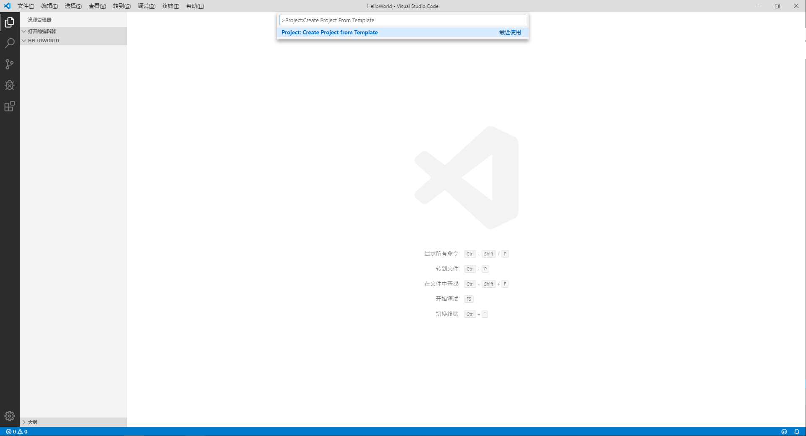
 &nbsp;

- 步骤3：输入helloworld-template模板的名称并回车。
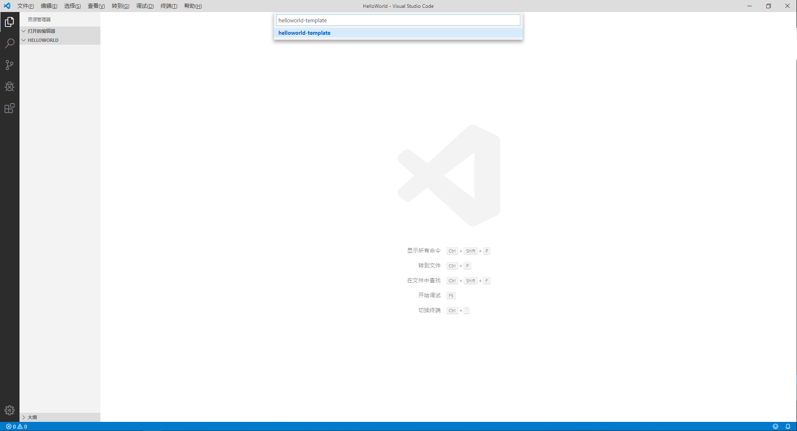
 &nbsp;

  选择模板后VS Code会自动在当前工程目录下增加模板中包含的文件。


### 2. 编码
标准工程模板“helloworld-template”已经实现了在InGateway设备中每10秒打印一条“hello world!”日志以及导入配置文件修改日志内容的功能。如需修改APP名称，请您参考下图修改main. py和setup.py中的代码。<font color=#FF0000>注意：Python APP名称中不能包含空格。</font>
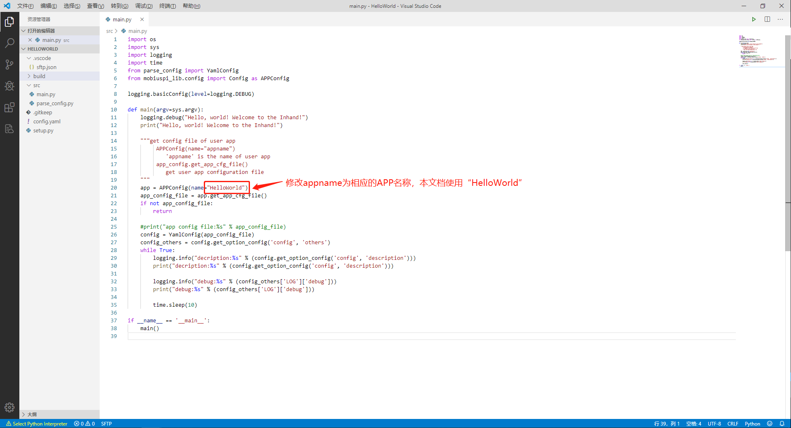
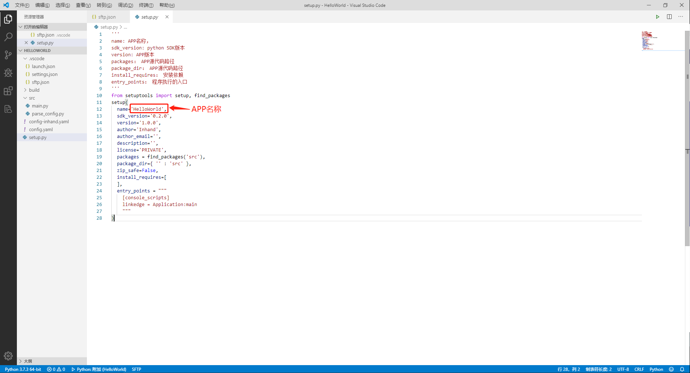

### 3. 调试
#### 3.1 建立SFTP连接
远程调试代码时需要先将本地代码上传到远程服务器（即InGateway设备）。上传本地代码前需要确认InGateway设备的调试模式已启用，启用调试模式后如下图所示：
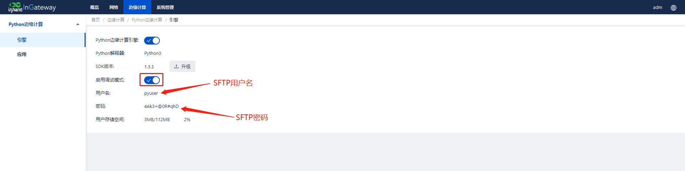
 &nbsp;

- 步骤1：打开`sftp.json`文件
  在命令面板中输入`>SFTP:Config` 命令后打开`sftp.json`文件。

 &nbsp;

- 步骤2：配置SFTP连接
  在`sftp.json`文件中根据InGateway设备“边缘计算”>>“Python边缘计算”>>“引擎”页面的连接参数配置SFTP连接。
  <font color=#FF0000>注意：Python APP名称应与mian. py中的APP名称保持一致。</font>

  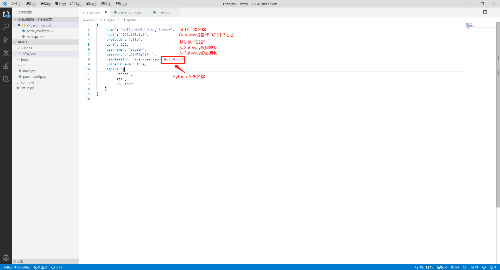
 &nbsp;

- 步骤3：配置完成并保存后在命令面板中输入`>SFTP:Open SSH in Terminal`以连接远端的服务器。
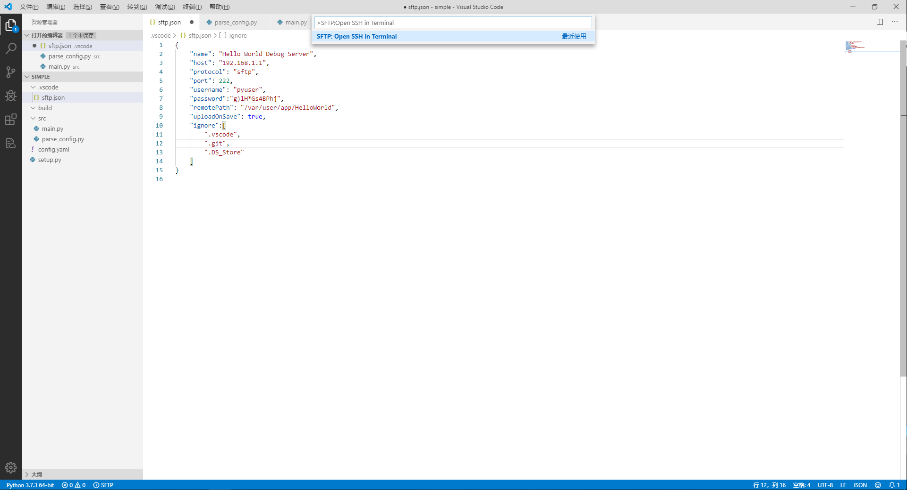
 &nbsp;

- 步骤4：输入后命令面板会提示您需要输入SFTP服务器的IP地址（即“host”项内容）。
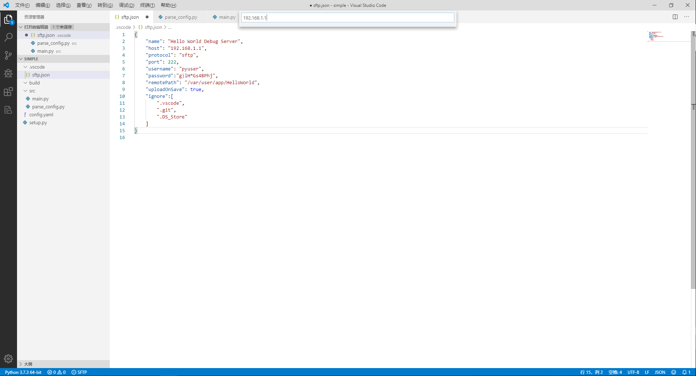
 &nbsp;

- 步骤5：首次连接时“终端”窗口会提示您是否要继续连接，此时输入“yes”并回车。随后再次在命令面板中输入`>SFTP:Open SSH in Terminal`和SFTP服务器的IP地址。

 &nbsp;

- 步骤6：“终端”窗口会提示您需要输入密码，您只需要将`sftp.json`文件中“password”项复制粘贴到此处即可。
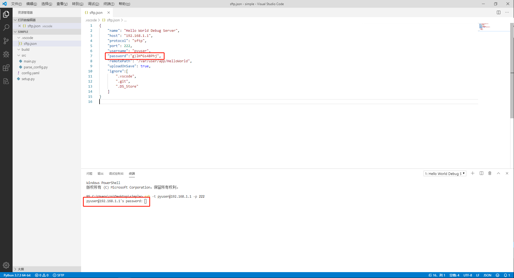
 &nbsp;

  成功与InGateway设备建立SFTP连接后如下图所示：
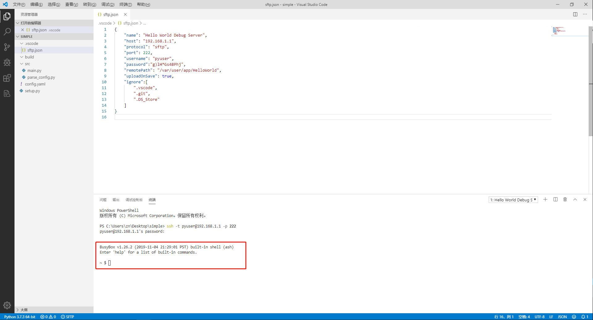

#### 3.2 调试代码
- 步骤1：同步代码
  SFTP连接成功后，在左侧空白处右键选择”Sync Local->Remote”将代码同步到远程服务器，同步成功后本地修改或者删除代码时都会自动和远端服务器同步。
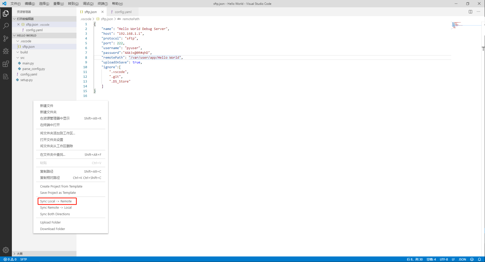
 &nbsp;

  可以在TERMINAL窗口查看远程服务器是否已接收到相应的APP代码。在TERMINAL窗口输入以下命令查看已上传的APP文件夹信息：
  >cd app  
  ls -l

  
 &nbsp;

- 步骤2：在终端窗口调试脚本
  同步代码后在终端窗口输入如下命令在InGateway设备中立即执行脚本，执行脚本后在终端窗口查看执行结果：打印“hello world!”。
  >python -m ptvsd --host 192.168.1.1 --port 3000 HelloWorld/src/main.py 

  - `192.168.1.1`为InGateway设备FE 0/1口的IP地址
  - `3000`为建议的调试端口号
  - `HelloWorld/src/main.py`为mian. py的执行路径，请根据您的当前位置适当调整

  InGateway设备的Python开发环境内置了ptvsd依赖库用于远程调试代码，想要了解更多ptvsd插件的用法，请访问[ptvsd使用说明](https://github.com/microsoft/ptvsd/blob/master/README.md)。
  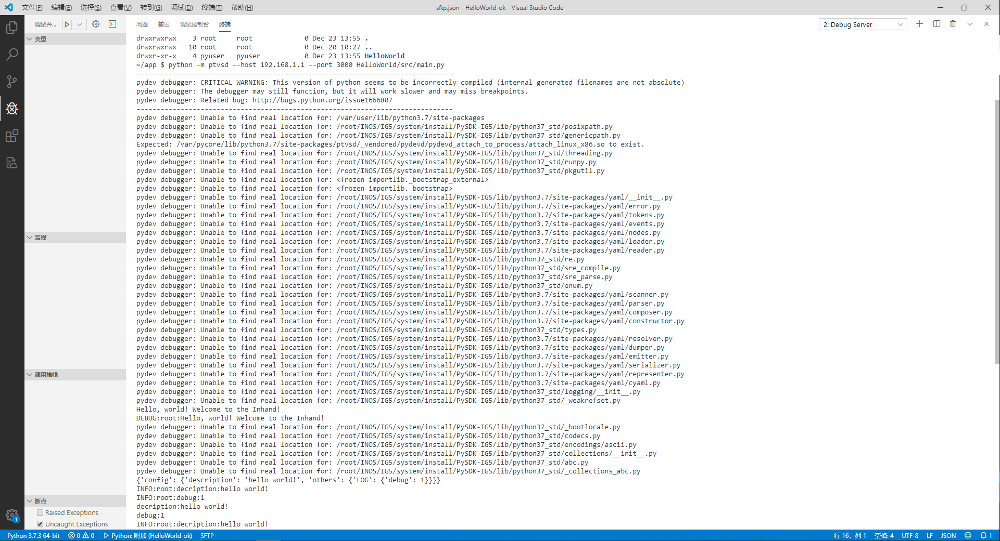
 &nbsp;

- 步骤3：调试完成后在终端使用`Ctrl + C`快捷键终止调试。
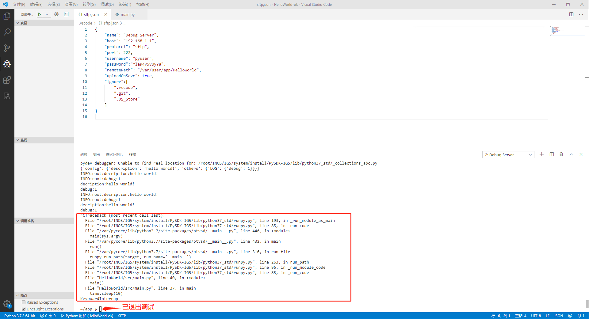

### 4. 构建APP发布包
调试完毕后可以构建APP发布包以便于将APP快速部署至其他InGateway设备。
- 步骤1：构建APP发布包
  在“终端”窗口执行`build_py_app.sh HelloWorld`命令构建APP发布包。（即build_py_app.sh 工程名称）
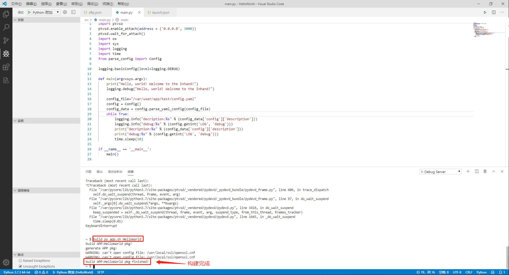
 &nbsp;

- 步骤2：下载APP发布包
  执行完成后在远程服务器的build目录下会自动生成APP发布包。右键本地的“build”文件夹并选择“Download Folder”将构建好的APP发布包下载到本地以便于后续部署。

 &nbsp;

  下载完成后在build目录下可以看到HelloWorld APP发布包。
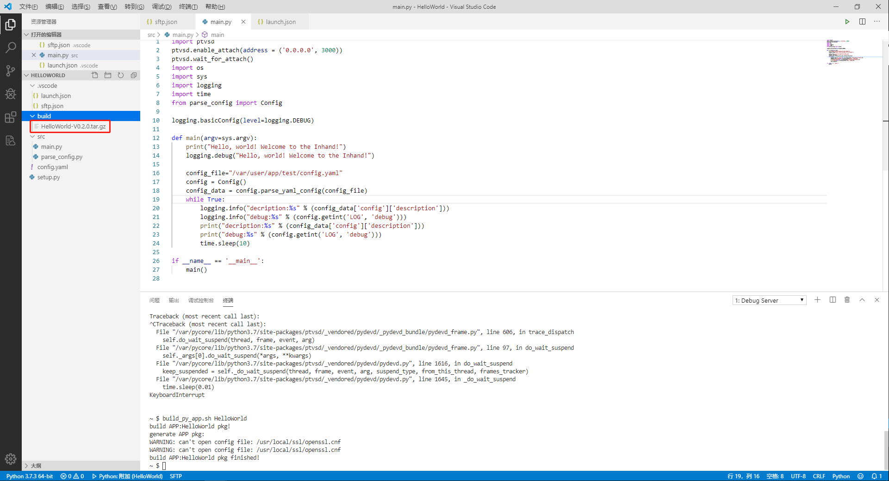

### 5. 通过InGateway Web页面部署App
执行构建APP发布包命令后会自动在已连接的InGateway设备上安装对应的APP。同时您还可以访问其他InGateway设备的“边缘计算”>>“Python边缘计算”>>“应用”>>“配置”页面导入并上传APP发布包将APP部署到其他InGateway设备上。部署方法如下：
- 步骤1：上传APP
  在InGateway设备的“边缘计算”>>“Python边缘计算”>>“应用”>>“配置”页面点击“添加”按钮。
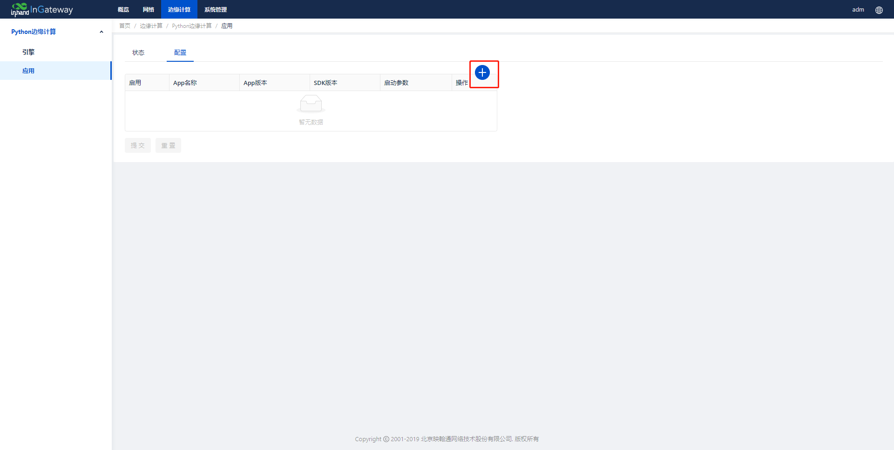
 &nbsp;

  选择“build”目录下的HelloWorld发布包。
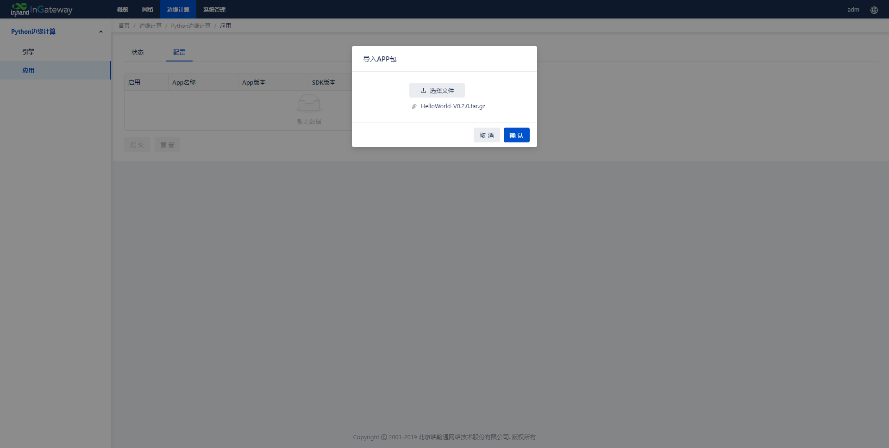
 &nbsp;

- 步骤2：启用APP
  上传完成后勾选“启用”HelloWorld App并点击提交，启用后APP将在InGateway设备中运行且每次开机自动运行。
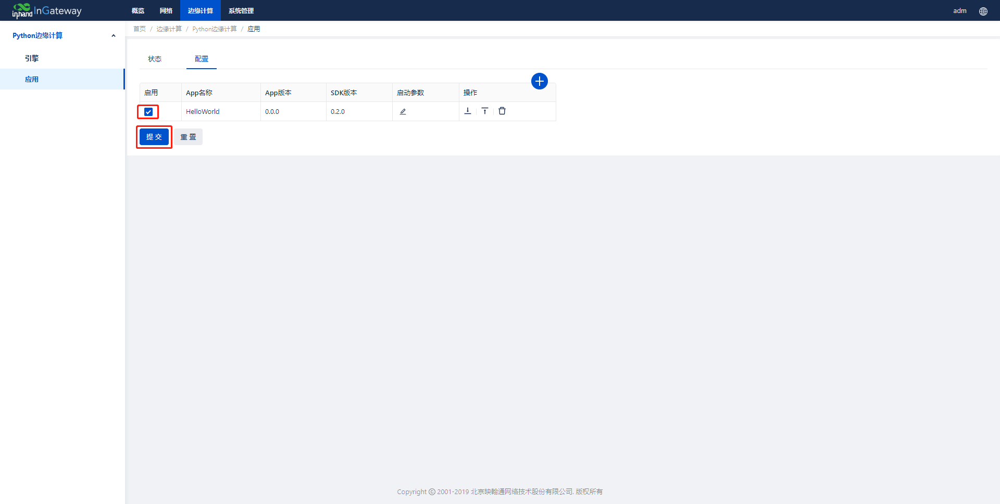
 &nbsp;

  在APP状态页面查看APP已成功运行在网关上，完成HelloWorld App的部署和运行。
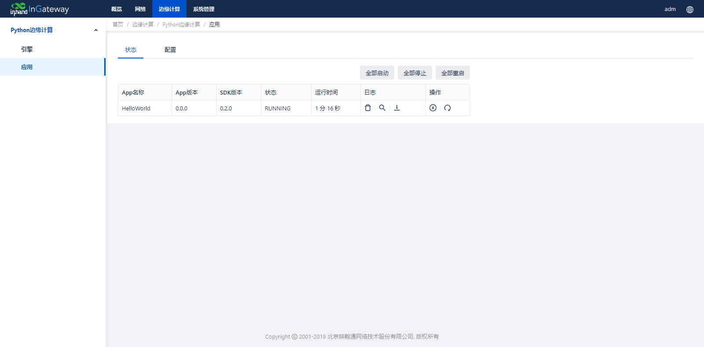

### 6. 查看APP运行状态
在InGateway设备的“边缘计算”>>“Python边缘计算”>>“应用”>>“状态”页面可查看App的运行状态。
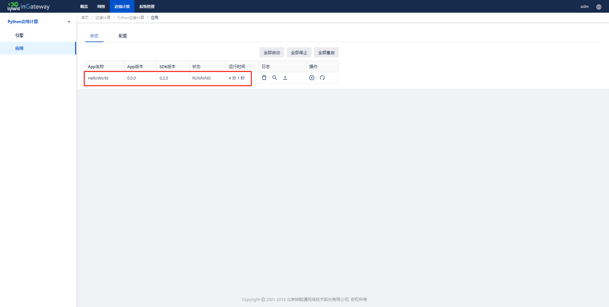

点击“查看日志”可查看App的运行日志。
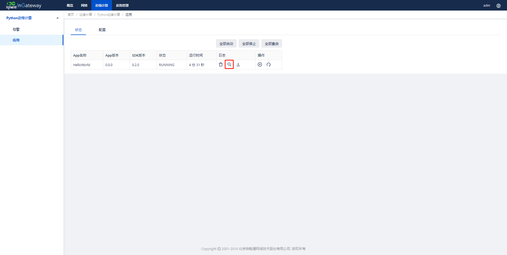
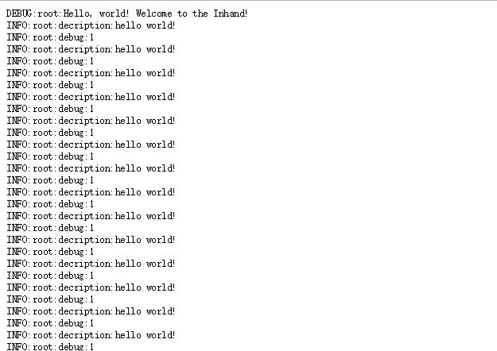
### 7. 为APP更新配置文件
- 步骤1：修改配置文件
  将App的“config.yaml”中的配置```description: "hello world!"```修改为:```description: "hello inhand!"```  
 
 &nbsp;

- 步骤2：导入配置文件并重启APP
  在InGateway设备的“边缘计算”>>“Python边缘计算”>>“应用”页面为“HelloWorld”APP导入修改后的配置文件并重启APP。  
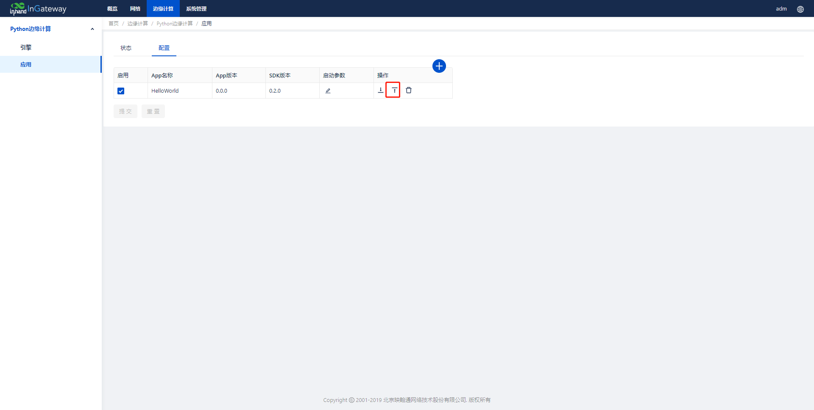 
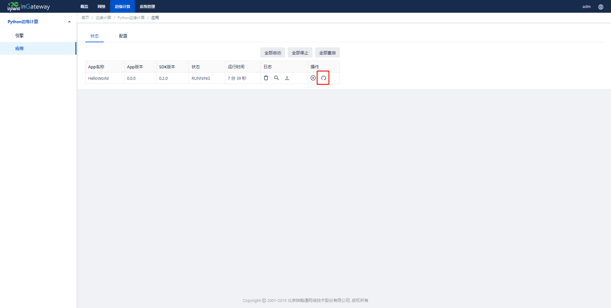
 &nbsp;

重启后“HelloWorld”APP将按照更新后的配置文件运行，即每10秒打印一条"hello inhand!"日志。


### 8. 附录
#### 8.1 使用pip为APP安装第三方依赖库
使用pip为APP安装第三方依赖库时需先启用InGateway设备的调试模式。
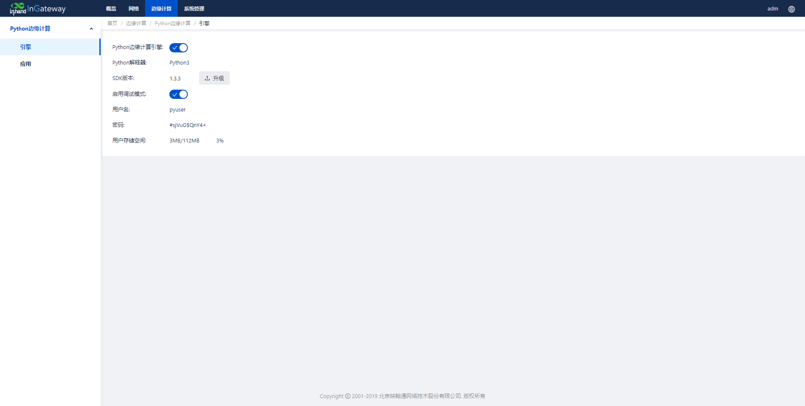
- 步骤1：使用VS Code与网关建立SFTP连接，详见“ [4.1 建立SFTP连接](#41-建立sftp连接)”。
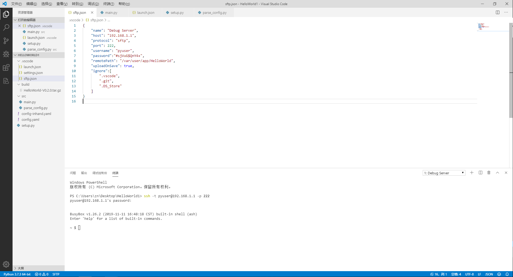
 &nbsp;

- 步骤2：执行pip install + “依赖库名称” + “==版本号” + “-t” + “APP的lib文件夹路径”命令并回车以安装相应依赖库。（不加版本号时pip会自动安装最新版的依赖库） 
  >pip install modbus_tk==1.1.0 -t /var/user/app/HelloWorld/lib/

  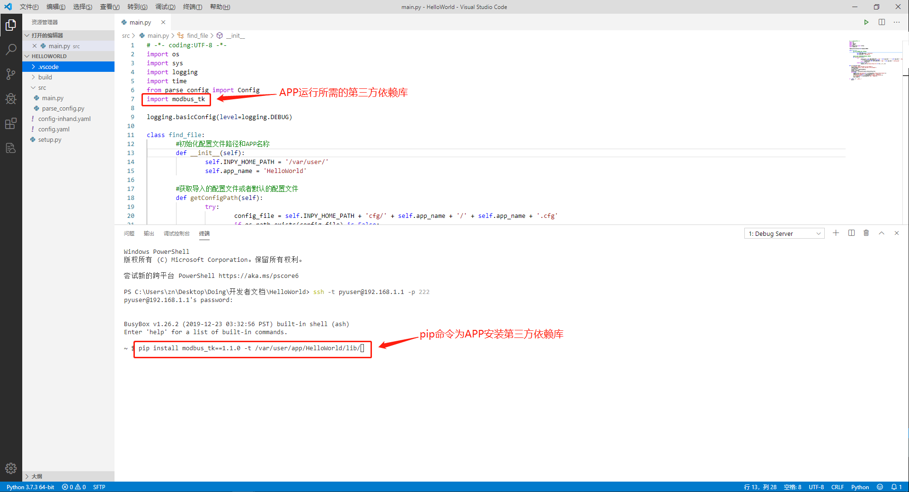
 &nbsp;

- 步骤3：随后会自动下载并安装相应的依赖库，安装成功后如下图所示：
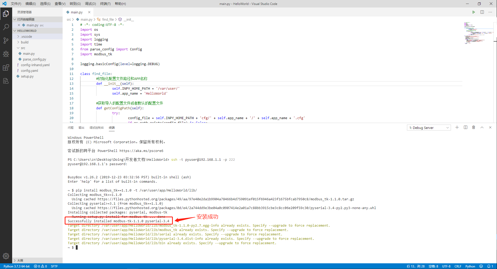
 &nbsp;

- 步骤4：使用`export`命令为APP设置环境变量。在终端窗口执行以下命令
  >export LD_LIBRARY_PATH=$LD_LIBRARY_PATH:/var/user/app/HelloWorld/lib/  

  >export PYTHONPATH=$PYTHONPATH:/var/user/app/HelloWorld/lib/

  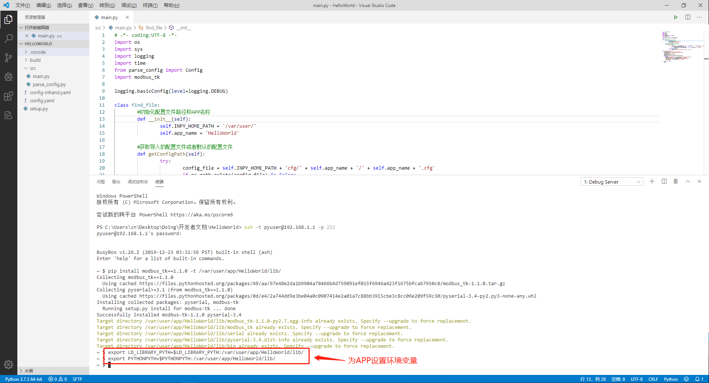
 &nbsp;

  为APP安装第三方依赖库后，调试前必须要为该APP配置相应的环境变量，否则APP将不能正常运行。当APP未在InGateway设备中运行时APP的环境变量为初始环境变量；APP运行时会自动添加lib文件夹下的第三方依赖库的环境变量。
 &nbsp;

- 步骤5：运行代码以确认APP运行正常
  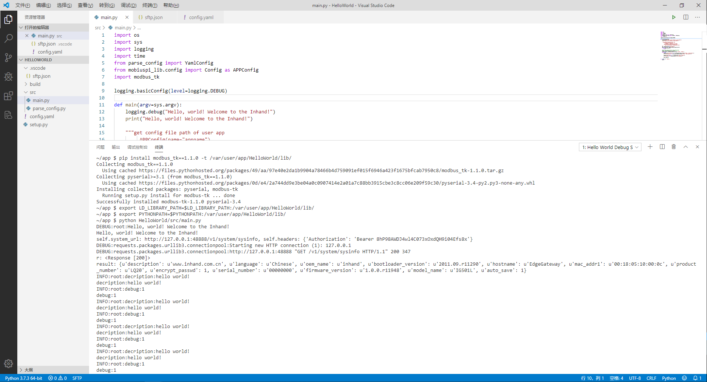

#### 8.2 启用代码自动补全
为了提高编码效率，您可以通过Python扩展插件实现代码自动补全功能。
- 步骤1：点击“文件”>>“首选项”>>“设置”进入设置页面。

 &nbsp;

- 步骤2：选择设置页面中的“扩展”>>“Python”项，找到“Auto Complete: Extra Paths”项并点击“在setting.json中编辑”。
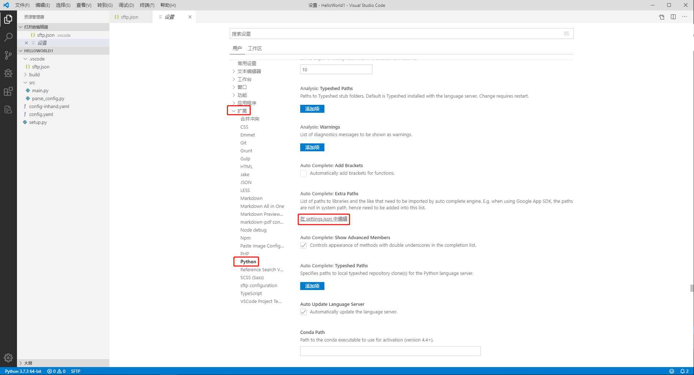
 &nbsp;

  在“settings.json”中增加如下配置项并保存（python.pythonPath为python解释器的安装路径）
  ```
  "python.linting.pylintEnabled":false,
  "python.linting.flake8Enabled":true,
  "python.jediEnabled":true,
  "terminal.integrated.rendererType":"dom",
  "explorer.confirmDelete":false,
  "python.pythonPath":"C:/Users/zn/AppData/Local/Programs/Python/Python37",
  ```
  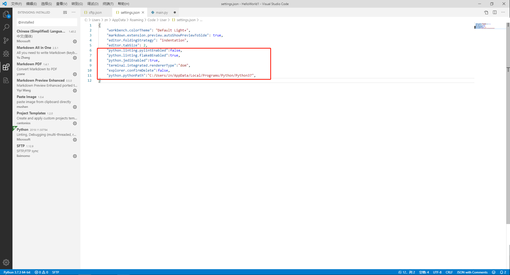

#### 8.3 FAQ
- Q1:建立SFTP连接时提示远程主机标识更新，认证失败应该怎么办？
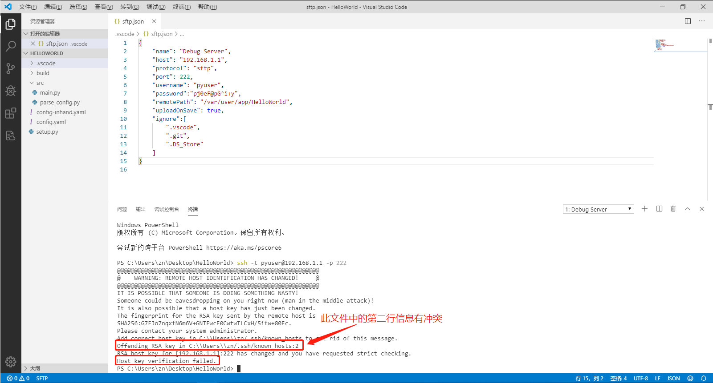
 &nbsp;

  A1：出现此问题的原因是因为InGateway设备的密钥更新了，但是PC上的密钥还未更新导致认证失败。此时您只需要删掉密钥文件中有冲突的那一行即可。(按住Ctrl并单击冲突项可以快速访问链接)

 &nbsp;

  删除后再次使用`>SFTP:Open SSH in Terminal`命令即可成功建立SFTP连接。

 &nbsp;

- Q2:建立SFTP连接后，在左侧空白处右键选择”Sync Local->Remote”将代码同步到远程服务器时提示“配置的身份验证方法失败”怎么解决？

 &nbsp;

  A2:确保“sftp.json”文件中的password项与InGateway设备的密码一致。一致后重新建立SFTP连接并同步代码。
