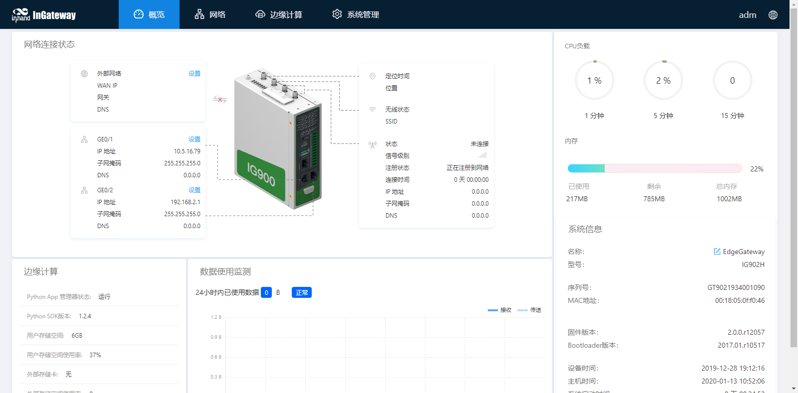

# InGateway902快速使用手册
本文档用于对InGateway902（以下简称IG902）联网、软件版本更新等基础配置操作进行说明，便于用户掌握IG902的基础配置和常用功能的使用方法。

## 1. 配置IG902网络参数
### 1.1 设置LAN网络参数：在局域网访问IG902
- 步骤1：IG902的GE 0/2口的默认ip地址为192.168.2.1，设置PC的IP地址与GE 0/2口处于同一网段。  
  - 方法一：自动获取IP地址（推荐）  

       
  
  
  - 方法二：使用固定IP地址  
    选择“使用下面的IP地址”，输入IP地址（默认为192.168.2.2~192.168.2.254中任意值）；子网掩码（默认255.255.255.0）；默认网关（默认为192.168.2.1）以及DNS服务器地址，单击确定。
       

- 步骤2：打开浏览器，访问IG902的GE 0/2口IP地址并输入登录用户名和密码。设备出厂的用户名/密码默认为adm/123456。
  

- 步骤3：登录成功后，您可以看到如下图所示的网页。
